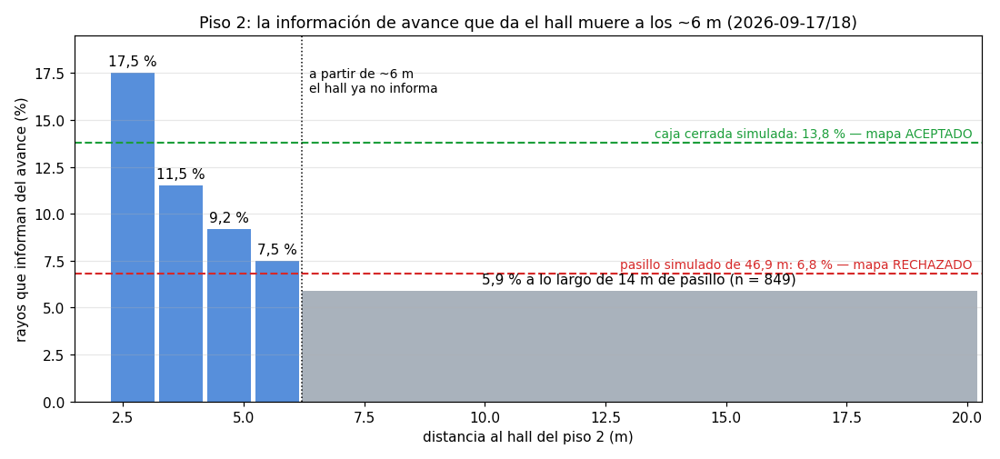

# Informe de avance — Semana 23

**Universidad Santo Tomás · Facultad de Ingeniería Electrónica · GED**
**Sistema colaborativo de robots móviles para asistencia de orientación en entornos interiores con múltiples pisos**

**Realizado por:** Santiago Hernández Ávila · Jonny Alejandro Mejía León
**Dirigido por:** Ing. Armando Mateus Rojas, Msc. · Ing. Nestor Ivan Ospina, Msc. · Ing. Oscar Mauricio Gélvez Lizarazo, Msc.
**Semana 23:** 14 al 20 de septiembre de 2026 · **Fase 5:** Integración del sistema y realización de pruebas — cierre de implementación

> La versión para compilar es [`Entregable_semana_23.tex`](Entregable_semana_23.tex) (en Overleaf; el
> logotipo de la portada no está versionado). Este Markdown tiene el mismo contenido y se lee
> directamente en el repositorio.

---

## 1. Introducción

La Semana 23 es la de **cierre de implementación**: el 18 de septiembre se congeló el código con la
etiqueta `v0.4-implementacion-congelada` (hito H7), y a partir de ahí no entra funcionalidad nueva.
Llegó a esa fecha con **tres de los cuatro objetivos específicos cerrados**.

Tres resultados la definen:

- **El segundo vehículo llegó el 14 de septiembre**, y la medida de red que llevaba un mes esperándolo
  se hizo ese mismo día: 600 de 600 mensajes, mediana de 7,61 ms. Con ella cierra **RF-15** y el
  riesgo **R11**, y el objetivo 2 se mueve por primera vez en cuatro semanas (§3).
- **La cancelación de misión se verificó con corrida y control**, y con ella el **objetivo 3 cierra al
  100 %**. La corrida corrigió el propio requisito que se había escrito esa mañana (§2).
- **Los dos pasillos reales quedaron medidos, y ninguno da información de avance**: 5,1 % en el piso 1
  y 5,9 % en el piso 2, por debajo del 6,8 % del pasillo simulado cuyo mapa ya había fracasado. Eso
  **cierra con evidencia** la vía de construir el mapa del pasillo recorriéndolo, y deja como única
  ruta crítica publicar la odometría en el vehículo (§4).

El criterio de cierre de la semana se cumple **en dos de sus tres partes**; la tercera —una corrida
física completa— no ocurrió, y se dice en el §8.

## 2. La cancelación de misión deja de ser inerte, y RF-29 se verifica corriendo

El botón de cancelar existía en la interfaz desde el 2 de septiembre y **no hacía nada**: `rclpy`
rechaza por defecto toda cancelación si el servidor de acciones no registra un `cancel_callback`, y
nadie lo había registrado. El trabajo de Jonny del fin de semana lo corrigió, y además hace que una
misión cancelada **devuelva el robot a la escalera de su piso** en lugar de dejarlo parado a mitad
de pasillo.

Se enunció **RF-29** con cuatro condiciones y, en vez de dejarlo redactado, **se corrió dos veces**:

| Corrida | Resultado |
|---|---|
| Cancelada | marca `CANCELANDO`, cierre `FALLIDA`, robot a **0,121 m** de la escalera contra el criterio de 0,25 m |
| Control, sin cancelar | cero marcas de cancelación, `COMPLETADA` |

La cancelación se dispara **por distancia y no por tiempo** —cuando `/odom` sitúa al robot a más de
8 m—, porque el robot nace a 1,4 m de la escalera: cancelar pronto satisfaría el criterio sin que el
robot se hubiera movido.

**La corrida corrigió al requisito.** Se había escrito pidiendo que el registro trajera el motivo
«Cancelada por el usuario», y el registro **nunca** lo trae: ese texto viaja en el resultado de la
acción, que no se graba. Un criterio escrito con cuidado pedía comprobar un campo que no existe donde
decía. Se corrigió antes de darlo por verificado.

## 3. El segundo vehículo, R11 cerrado y RF-15 medido

El codirector entregó el segundo DeepRacer (`amss-jgm9`), y la medida de latencia entre vehículos se
hizo el mismo día, con cotas fijadas **antes** de medir:

| | Medido | Cota |
|---|---|---|
| Mensajes | 600 de 600, 0 % de pérdida | 0 % |
| Ida y vuelta, mediana | **7,61 ms** | 100 ms |
| Ida y vuelta, p95 | **20,76 ms** | 250 ms |

Con margen de 13 veces en la mediana, **la red no limita** la publicación de estado a 2 Hz. Cierra
**RF-15**, cierra **R11** tras 31 días, y el objetivo 2 sube de **55 a 65 %**.

Dos cosas que la sesión enseñó y no estaban en el guion:

- **El cortafuegos tenía cortada la pareja de vehículos en los dos sentidos.** `ping` pasaba y el grafo
  de ROS salía vacío. RF-15 estuvo un mes en rojo por dos causas, y solo una era el hardware.
- **La IP no identifica un vehículo entre sesiones**: el DHCP la cambia. Los identificadores
  permanentes pasan a ser nombre de máquina y MAC.

## 4. Los pasillos reales no dan información de avance

El vehículo no tiene encoders: su odometría la deduce `rf2o` comparando barridos consecutivos del
LiDAR. En un pasillo recto y uniforme **el barrido siguiente es igual al anterior aunque el vehículo
haya avanzado**, y rf2o devuelve cero. La herramienta `medir_informacion_avance.py` mide, sobre un
barrido, qué fracción de los rayos informa del avance. Las referencias ya medidas eran 13,8 % en una
caja cerrada simulada —mapa aceptado— y 6,8 % en el pasillo simulado —mapa rechazado—.

| Entorno | Información de avance |
|---|---|
| Pasillo real, piso 1 | **5,1 %** |
| Pasillo real, piso 2 | **5,9 %** (n = 849) |

Para el piso 2 se escribió una **predicción antes de medir** —entre 8 y 14 %, porque tiene el doble de
accidentes arquitectónicos— y **quedó falsada**. La causa está en la figura: la información que da un
hall **muere a los ~6 m**, no a los 10–12 m de alcance del sensor, que es lo que se había supuesto.

*Figura 1. Piso 2: 17,5 % a 2,2 m del hall, 5,9 % a partir de 6,2 m. El umbral coincide con el que la
Semana 22 había medido por otro instrumento.*

**Lo que esto no dice, y hay que escribirlo con el mismo peso:** no dice que el edificio no se pueda
navegar. La campaña de evaluación en simulación corrió en esos mismos pasillos y dio **86,7 % de
éxito** con mapa conocido. Lo que el pasillo no soporta es **construir el mapa recorriéndolo**.

De la corrida perdida del piso 2 salió además que **el LiDAR está montado girado 180°**, de modo que su
cuña ciega de 60° apunta hacia delante.

## 5. La escala de tracción, medida sobre el vehículo

El 17 de septiembre se midió por primera vez la escala de `/cmd_vel` sobre el carro, y trajo **dos
defectos en lugar de uno**: además de que toda orden por debajo de 0,40 m/s sale como tracción cero, el
nodo aplica un reescalado posterior que comprime los tres escalones a 0,4247 / 0,6242 / 0,7341. La
dirección del vehículo nunca se había centrado, y se recalibró.

Y un **incidente de seguridad**: un solo comando de tracción **movió los dos vehículos**, porque los dos
comparten dominio de ROS y el tópico de servos no lleva espacio de nombres. Es el pendiente de
«espacios de nombres» del objetivo 2 manifestándose como riesgo físico. Desde entonces, **en campo
solo va encendido un vehículo**.

## 6. Congelación, y el mapa de lo que queda

El 18 de septiembre se congeló el código (`v0.4-implementacion-congelada`) y se emitió
`MAPA_TRABAJO_RESTANTE.md`, que acota en un solo documento todo lo que queda hasta la sustentación. Su
lectura central: **hay una sola ruta crítica, y es publicar la transformada `odom → base_link` en el
vehículo real**. Los seis requisitos abiertos son todos de hardware.

## 7. Otros avances de la semana

- **R14 cerrado** (16-sep) con sus siete acciones, dos de ellas ejecutadas en contra de su enunciado
  y con la razón escrita. Al preparar la recomposición de los registros se comprobó que recomponer
  reescribía la procedencia en 44 de 44, así que **no se recompone ninguno** — y de paso quedó probado
  que la cadena bag → registro es reproducible, 44 de 44 sin mover un veredicto.
- **El entregable versionado pasa a ser la fuente `.tex`**, no el PDF compilado en Overleaf.
- **`GUIA_ARRANQUE.md`**: la secuencia completa de arranque vivía repartida en la cabeza de dos
  personas; ahora la puede ejecutar alguien que no estuvo.
- **El capítulo de resultados de la campaña en simulación se adelantó de S24** (19-sep). Encontró que
  los cuatro fallos son **un solo modo con nombre** —Nav2 declara `SUCCEEDED` y `/odom` sitúa al
  vehículo entre 0,269 y 0,345 m de la meta— y lo atribuye a la estimación de pose, entre 1,35 y 2,22
  veces lo presupuestado. Y deja escritas dos anotaciones incómodas: los criterios C1 y C2 no son
  independientes en ese modo, y tres misiones se corrieron dos veces sin motivo registrado.

## 8. Aporte de la semana a los objetivos específicos

| Actividad | Objetivo | Contribución |
|---|---|---|
| Cancelación de misión y RF-29 | OE3 | Último requisito del objetivo 3; lo cierra seis de seis |
| RF-15 con los dos vehículos | OE2 | Primer requisito de hardware verificado; cierra R11 |
| Información de avance de los dos pisos | OE2 | Cierra con evidencia la vía del mapa por SLAM en el pasillo |
| Escala de tracción sobre el vehículo | OE2 | Convierte RF-14 en una medida pendiente acotada |
| R14 y reproducibilidad de registros | OE4 | La campaña se regenera desde sus datos |
| Capítulo de resultados | OE4 | Nombra el modo de fallo y lo atribuye con cifras |

| ID | Avance | Cubierto esta semana | Lo que lo mantiene detenido |
|---|---|---|---|
| OE1 | 100 % | — | — |
| OE2 | 55 % → **65 %** | RF-15 verificado; pisos medidos | La cadena de odometría sobre el vehículo |
| OE3 | 90 % → **100 %** | RF-29 verificado | — |
| OE4 | 85 % | Resultados escritos; R14 cerrado | RF-27, la campaña física |

El avance técnico agregado sin ponderar es del **87,5 %** frente a un **71,9 %** del calendario
(semana 23 de 32). **Veintinueve de treinta y seis requisitos están verificados.**

> *La tabla-resumen de `REQUISITOS.md` decía 28, porque RF-15 no se había pasado a verificado en ella
> tras el 14 de septiembre; se corrige el 25 de septiembre recontando fila por fila.*

**Eso no es holgura.** Todo lo que falta es hardware, y no depende solo de horas de trabajo.

## 9. Estado del cronograma

| Exigencia del criterio de cierre | Estado | Evidencia |
|---|---|---|
| El sistema corre de extremo a extremo en simulación | **Cumplido** | Corridas de RF-29, 14-sep; misión desde teléfono de S22 |
| Se ejecuta al menos una corrida física completa | **No cumplido** | La primera navegación sobre el vehículo ocurre el 24-sep, en S24 |
| Repositorio etiquetado | **Cumplido** | `v0.4-implementacion-congelada`, 18-sep |

De las cuatro actividades planificadas se ejecutaron **tres**: verificación y corrección de fallos,
congelación del código y emisión del informe de S22. **El ensayo en blanco del protocolo con los
vehículos reales no se ejecutó**: la cadena de odometría del vehículo no existía todavía. Surgieron
sin planificar la llegada del segundo vehículo, la medición de los dos pisos, la escala de tracción
en campo y el capítulo de resultados.

**Para la Semana 24:** resolver el GO/NO-GO de la demostración física, publicar la odometría en el
vehículo —la ruta crítica—, consolidar el conjunto de datos de la campaña y emitir este informe.

## 10. Conclusiones

1. **La implementación está congelada con tres de cuatro objetivos cerrados**, y el que falta es el de
   la plataforma física.
2. **El segundo vehículo cerró un requisito el día que llegó**, y enseñó que la mitad de su bloqueo no
   era hardware sino un cortafuegos.
3. **El objetivo 3 queda completo**, y su último requisito se corrigió al correrlo, no al escribirlo.
4. **Los pasillos reales no dan información de avance**, medido en los dos pisos y con una predicción
   falsada por el camino. Se cierra con evidencia una vía y queda una sola ruta crítica.
5. **La corrida física completa que pedía el criterio no ocurrió.** Se declara como incumplida en lugar
   de reinterpretar el criterio.

## Anexo — evidencia citada

| Documento | Qué sostiene |
|---|---|
| `Documentos/Evidencia/registros/S23_RF29_cancelada.json` y `…_control.json` | RF-29 |
| `Documentos/Evidencia/registros/S23_RF15_carroA_carroB.json` | RF-15 |
| `Documentos/Evidencia/S23_informacion_avance_piso1.md` y `…_piso2.md` | §4 |
| `Documentos/Evidencia/S23_campo_traccion_RF14.md` | §5 |
| `Documentos/Evidencia/S23_reproducibilidad_de_los_registros.md` | reproducibilidad 44/44 |
| `Documentos/MAPA_TRABAJO_RESTANTE.md` | §6 |
| `Documentos/RESULTADOS_OE4_SIMULACION.md` | capítulo de resultados |
| `Documentos/GUIA_ARRANQUE.md` | arranque replicable |
