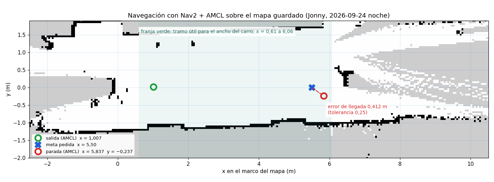

# Informe de avance — Semana 24

**Universidad Santo Tomás · Facultad de Ingeniería Electrónica · GED**
**Sistema colaborativo de robots móviles para asistencia de orientación en entornos interiores con múltiples pisos**

**Realizado por:** Santiago Hernández Ávila · Jonny Alejandro Mejía León
**Dirigido por:** Ing. Armando Mateus Rojas, Msc. · Ing. Nestor Ivan Ospina, Msc. · Ing. Oscar Mauricio Gélvez Lizarazo, Msc.
**Semana 24:** 21 al 27 de septiembre de 2026, con corte el viernes 25 · **Fase 5:** Integración del sistema y realización de pruebas

> La versión para compilar es [`Entregable_semana_24.tex`](Entregable_semana_24.tex) (en Overleaf; el
> logotipo de la portada no está versionado). Este Markdown tiene el mismo contenido y se lee
> directamente en el repositorio.

---

## 1. Introducción

El cronograma reservaba esta semana para la campaña experimental en simulación, que se había
adelantado a la Semana 21; lo que quedaba de ella —consolidar los datos y escribir los resultados—
se cumplió (§2). **La semana, en cambio, fue la del vehículo real.** Empezó con la decisión de
intentar la demostración física y terminó con **Nav2 navegando el carro de forma autónoma** sobre un
mapa que el propio carro había construido.

El acta de decisión fija seis compuertas con fecha. Al cierre de la semana:

| Compuerta | Qué pide | Estado |
|---|---|---|
| **G-1** actuación | el vehículo responde a las órdenes de servo | ✅ **alcanzada** el 22-sep |
| **G-4** dos en el grafo | dos vehículos y el coordinador sin colisión de nombres | ✅ **alcanzada** el 22-sep |
| **G-2** odometría | error ≤ 10 % sobre un recorrido medido de ≥ 5 m | ⏳ medida sobre 3 m; falta la de 5 m con cinta |
| **G-3** navegación de uno | punto a punto con Nav2, llegada verificada | ⏳ navegó una vez; paró a 0,412 m con tolerancia de 0,25 |
| **G-5** protocolo completo | una misión con relevo sobre los dos vehículos | ⏳ |
| **G-6** RF-27 | 5 a 10 misiones con el protocolo completo | ⏳ pide primero G-5 |

G-2 y G-3 tienen fecha: **corte C-1, viernes 2 de octubre**.

## 2. Objetivos de la semana

> *30 corridas registradas y conjunto de datos versionado en el repositorio.*

**Cumplido.** Las 30 corridas se hicieron en la Semana 21, y la consolidación (21-sep) comprobó lo que
hace útil a un conjunto de datos: **que un tercero, con solo el repositorio, llegue de los registros a
las cifras publicadas**. El capítulo de resultados se escribió por adelantado el 19-sep.

**Con una reserva que se abrió el viernes (R15):** el mapa con que corrió aquella campaña leía como
libre su espacio desconocido —`free_thresh: 0.25`, desde el 12 de agosto—. No invalida el veredicto
por sí solo: los cuatro fallos fueron de precisión de llegada, no de trazado. Pero hay que decidir
si se comprueba sobre las grabaciones o se declara como limitación.

## 3. La decisión: GO pleno, con los criterios de reversión escritos antes

El 21 de septiembre se resolvió el GO/NO-GO, abierto tres semanas: **la demostración física se intenta
con los dos vehículos reales**. Lo que lo hace defendible no es el veredicto sino sus **seis
compuertas con criterio de fallo y fecha escritos antes de intentarlas**, para que el GO no pueda
degradarse en silencio. El mismo día se cerró R6 con una fe de erratas del informe de S15 —que solo
existe como PDF— en lugar de reescribirlo.

## 4. Una sola causa para tres semanas de síntomas

El segundo vehículo se había dado por averiado. **No lo estaba.** Los nodos del fabricante corren como
`root`, y el middleware de ROS 2 comparte memoria con permisos solo del dueño: una orden lanzada como
usuario normal **descubre los nodos pero no se comunica con ellos, y no da ningún error**. Eso explicaba
a la vez listas de nodos vacías, servicios que no respondían y órdenes que no movían nada.

Con el dueño correcto, el 22-sep se alcanzaron dos compuertas:

- **G-1 · actuación:** dirección a los dos lados y proporcional, tracción en los dos sentidos, y
  parada en menos de un segundo al soltar la orden.
- **G-4 · dos en el grafo:** los dos vehículos y el coordinador conviviendo sin colisión de nombres.

Y la primera mitad de **RF-16** sobre hardware: los 22 ficheros del coordinador tienen **el mismo md5**
en el repositorio y en los dos vehículos, y compilan sin un aviso en las dos distribuciones.

## 5. Los vehículos se grababan el uno al otro

El 23-sep se descubrió que, con los dos vehículos encendidos, **la grabación de uno recoge también el
LiDAR del otro**, intercalado, en un archivo que parece sano. Con cuatro confirmaciones
independientes, **los cinco registros de la salida del 28 de agosto quedan retirados**. No hay
comprobación en vivo que lo detecte, así que la regla es operativa: **un solo vehículo encendido**, y
la comprobación se hace sobre la grabación ya hecha.

El mismo día, ensayar el guion de campo contra el vehículo encontró **tres defectos que no daban
error**, el peor que interrumpir una orden remota dejaba el grabador huérfano y grabando.

## 6. La escalera de Nav2, peldaño a peldaño sobre el vehículo

El 24-sep la cadena de navegación se subió **por peldaños**, comprobando cada uno antes del siguiente.

**Peldaños 1 a 3 — la odometría mide.** La transformada del vehículo quedó versionada, y `rf2o`
publica la odometría. Sobre `amss-jgm9`, empujando a mano tres recorridos de 3,00 m medidos con
flexómetro:

| Pasada | Odometría ÷ cinta |
|---|---|
| 1 | 0,963 |
| 2 | 1,019 |
| 3 | 0,966 |

Media **0,982**, σ 0,032: **las tres dentro del ±10 %**. **No es todavía G-2**: son 3 m y G-2 pide 5, y el
sitio tenía estructura por los cuatro lados.

**Peldaños 4 y 5 — el mapa sobre el vehículo.** El SLAM corrió a bordo por primera vez. En un cuarto
de 1,60 × 0,76 m medidos con cinta, la sala salió de 1,50 × 0,80 m y 1,60 × 0,95 m en dos corridas; y
un extintor puesto como obstáculo apareció como una mancha aislada de 0,25 × 0,15 m.

**Mapear conduciendo.** El vehículo se condujo solo por el pasillo del piso 2 midiendo contra su
odometría —6,093 m y 6,032 m pedidos 6,00—, con una deriva en reposo de 1 a 25 mm, y construyó este mapa:

*Figura 1. 447 × 108 celdas de 5 cm; pasillo de 2,70 m entre muros, y dos objetos aislados que son,
casi con seguridad, las cajas que acotaban el tramo.*

**Peldaños 6 y 7 — Nav2 navega el carro.** Esa misma noche, Jonny cargó ese mapa y **Nav2 llevó el
vehículo de forma autónoma**:

*Figura 2. De x = 1,007 hacia una meta en x = 5,50: avance de 4,837 m, parada a 0,412 m de la meta.*

Que fue navegación y no un empujón lo dicen tres cosas de la grabación: el plan **se fue consumiendo**
(59 → 7 poses), **la dirección trabajó** —corrigiendo el rumbo cuando el carro se desviaba— y las
órdenes salieron del planificador. **La precisión de llegada no:** 0,412 m contra una tolerancia de
0,25. La causa está medida: por debajo de 0,40 m/s el vehículo no se mueve, así que se aproxima a la
meta sin poder frenar antes, y la sobrepasa.

## 7. Las compuertas, montadas; el bloqueo del sistema real, diseñado

El 25-sep quedó lista la sesión que convierte esa navegación en G-2 y G-3, en
`GUIA_CAMPANA_NAV2_HARDWARE.md`, escrita para que la ejecute cualquiera que descargue el repositorio:

*Figura 3. El tramo útil para el ancho del carro mide 5,45 m, así que caben corridas de 5 m —lo que
pide G-2— sin volver a mapear.*

- **Tres corridas de 5 m con cinta cierran G-2 y dan G-3.** No cuentan para RF-27, que pide el
  protocolo completo sobre los dos carros.
- **El bloqueo del sistema real, diseñado.** Con los dos carros encendidos, una orden mueve los dos y
  cada odometría recibe el láser del otro, porque los tópicos de fábrica no llevan espacio de nombres.
  La solución —una partición DDS por vehículo para esos tópicos, sin tocar el software de AWS— pasó
  **9 de 9** en el portátil y se confirma en los carros el lunes 28 (`DISENO_AISLAMIENTO_DOS_CARROS.md`).
- La herramienta que ejecuta cada corrida se **ensayó contra Nav2 en simulación** con los vehículos
  apagados. El ensayo encontró que la pose de AMCL, al parar, puede ir **hasta 25 cm atrasada**; forzando
  su corrección, AMCL y la odometría quedan a **1,7 cm**.
- En paralelo, Jonny escribió `GUION_NAVEGACION_USTA.md`, la vía hermana: navegar el edificio sobre el
  mapa del modelo de Gazebo, **validando antes el modelo contra el edificio con flexómetro** (≤ 2 %).
  Las dos comparten el arranque, `nav2_mapa_guardado.sh`.
- Ver la corrida después, en RViz, funciona. **Verla en vivo desde el portátil no**: las dos
  distribuciones de ROS se descubren pero no intercambian datos. Está medido.

## 8. Lo que la semana corrigió de sí misma

Cinco conclusiones de esta misma semana resultaron falsas, y se publican corregidas en vez de
borrarse:

1. **La «avería» del segundo vehículo** (21-sep) no existía: era la regla del dueño del §4.
2. **Que el LiDAR se podía leer sin privilegios** (24-sep, mañana) se refutó esa tarde con cero
   barridos en 20 s.
3. **Que `amss-jgm9` no tenía Nav2 ni rf2o, y que Nav2 no podía navegar por cuatro defectos de
   configuración** (24-sep, noche): falso las dos veces. El vehículo estaba nivelado ese día, y los
   defectos eran de un fichero que el vehículo no carga. Jonny navegó esa misma noche.
4. **Que el carro «avanzó 5 m»** (25-sep): es la distancia entre las cajas y la impresión de que llegó
   cerca, no una medida.
5. **Que las corridas de un solo carro contaban para RF-27** (25-sep): RF-27 pide el protocolo
   completo, con los dos carros y el relevo entre pisos.

## 9. Aporte de la semana a los objetivos específicos

| Actividad | Objetivo | Contribución |
|---|---|---|
| Acta GO/NO-GO | OE2, OE4 | Fija qué se intenta y cuándo se desiste, antes de intentarlo |
| Causa raíz de la comunicación con el vehículo | OE2 | Explica tres semanas de síntomas; desbloquea todo lo demás |
| G-1 y G-4 | OE2 | Actuación y dos vehículos en el mismo grafo, verificados |
| Odometría medida sobre 3 m | OE2 | Primera evidencia física de RF-13 |
| SLAM y Nav2 sobre el vehículo | OE2, OE4 | La navegación autónoma física existe |
| Sesión de compuertas y diseño del aislamiento | OE2, OE4 | Deja G-2 y G-3 medibles antes del corte, y desbloquea el sistema real |
| Consolidación de datos | OE4 | Criterio de cierre de la semana |

| ID | Avance | Cubierto esta semana | Lo que lo mantiene detenido |
|---|---|---|---|
| OE1 | 100 % | — | — |
| OE2 | **65 %** (sin cambio) | G-1, G-4, odometría, SLAM y Nav2 sobre el vehículo | Ninguno de sus cinco requisitos parciales cerró todavía |
| OE3 | 100 % | — | — |
| OE4 | **85 %** (sin cambio) | Datos consolidados | RF-27, que pide el sistema completo; y la decisión sobre R15 |

El avance agregado sin ponderar sigue en **87,5 %**, frente a un **75,0 %** del calendario (semana 24 de
32). **Veintinueve de treinta y seis requisitos verificados**, los mismos que la semana anterior.

**Por qué el objetivo 2 no sube en la semana en que más avanzó.** El porcentaje se mueve cuando un
requisito cierra, y ninguno de los cinco parciales de OE2 cerró: cada uno tiene ahora evidencia sobre
el vehículo, pero les falta la medida de 5 m, el espacio de nombres o la segunda mitad de su criterio.
Subirlo por la sensación de avance sería exactamente lo que el tablero existe para impedir. **Lo que sí
cambió es el riesgo**: la navegación autónoma física ya no es una pregunta abierta.

## 10. Estado del cronograma

| Exigencia del criterio de cierre | Estado | Evidencia |
|---|---|---|
| 30 corridas registradas | **Cumplido** | Semana 21; 30 registros validados |
| Conjunto de datos versionado | **Cumplido** | Consolidación del 21-sep: regenera sus propias métricas |

Las tres actividades planificadas se cumplieron: consolidar los datos, escribir el capítulo de
resultados —adelantado a la Semana 23— y emitir el informe de S23. **Todo el trabajo sobre el vehículo
real no estaba planificado para esta semana** y se declara como tal: el cronograma lo situaba en S25,
y lo que se hizo aquí es la preparación que lo hace posible.

**Para la Semana 25**, con el plan día a día en `PLAN_S25.md`: la sesión de compuertas G-2 y G-3
antes del corte C-1 del **viernes 2 de octubre**; aislar los dos carros y montar la pila con espacio
de nombres; validar con cinta el modelo del edificio y medir la red entre pisos; y pedir por escrito a
los directores el sitio de la etapa 3, el N de RF-27 y la tolerancia de llegada. **El sistema real
—G-5— va en la Semana 26 y la campaña de RF-27 en la 27**, con cierre de datos el 16 de octubre.

## 11. Conclusiones

1. **El sistema llegó al vehículo real.** En cinco días se pasó de decidir intentarlo a que Nav2
   navegara el carro de forma autónoma sobre un mapa construido por el propio carro.
2. **Una sola causa explicaba tres semanas de síntomas**, y encontrarla desbloqueó dos compuertas el
   mismo día.
3. **La odometría del vehículo mide**: tres de tres dentro del ±10 % sobre 3 m. Falta la medida de
   5 m con cinta, que es G-2.
4. **La navegación funciona y la precisión de llegada no**, con el mecanismo medido. La tolerancia
   es decisión de los directores y tiene que tomarse antes de la campaña.
5. **La sesión que cierra G-2 y G-3 está montada, ensayada en simulación y documentada**, y el bloqueo
   que impide el sistema real —los dos carros pisándose— tiene un diseño probado en el portátil.
6. **Cinco conclusiones de la semana se corrigieron dentro de la misma semana**, y se publican
   corregidas.

## Anexo — evidencia citada

| Documento | Qué sostiene |
|---|---|
| `Documentos/ACTA_GO_NOGO.md` | §3 y las compuertas |
| `Documentos/Evidencia/S24_sonda_actuacion_amss_ez9n.md` | §4, G-1 |
| `Documentos/Evidencia/S24_compuerta_G4_dos_en_el_grafo.md` | §4, G-4 |
| `Documentos/Evidencia/S24_RF16_compilacion_jazzy_hardware.md` | §4, RF-16 |
| `Documentos/Evidencia/S24_dos_carros_listos.md` | §5 |
| `Documentos/Evidencia/S24_peldano2_odometria_hardware.md` | §6, odometría |
| `Documentos/Evidencia/S24_mapas_cuarto_extintor.md` | §6, SLAM |
| `Documentos/Evidencia/S24_mapeo_6m_hardware.md` | §6, mapeo conduciendo |
| `Documentos/Evidencia/S24_nav2_navegacion_mapa_guardado.md` | §6, Nav2 |
| `Documentos/Evidencia/S24_consolidacion_datos_oe4.md` | §2 |
| `Documentos/GUIA_CAMPANA_NAV2_HARDWARE.md` y `GUION_NAVEGACION_USTA.md` | §7 |
| `Documentos/DISENO_AISLAMIENTO_DOS_CARROS.md` y `PLAN_S25.md` | §7 y §10 |
