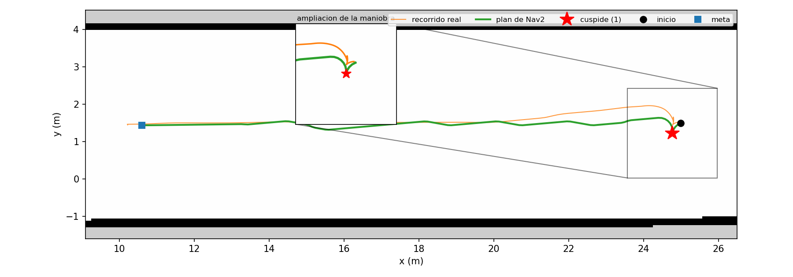

# Evidencia

Índice de todo lo que esta carpeta contiene: qué muestra cada archivo, de cuándo es y qué
afirmación sostiene.

Existe porque una captura sin pie de foto no es evidencia. A los seis meses nadie recuerda
qué demostraba, y ante un jurado no se puede citar lo que no se puede explicar. Diez de
estas imágenes llevaban meses en el repositorio sin que ningún documento las mencionara:
estaban guardadas, no documentadas. La diferencia importa.

**La regla:** toda evidencia nueva entra con su fila en este índice, en el mismo commit.

---

## Semana 12 — el vehículo aparece, obedece y publica odometría (abril 2026)

Primera validación del stack en simulación: que el modelo cargue, que el LiDAR emita y que
el lazo `/cmd_vel` → movimiento → `/odom` esté cerrado.

`gazebo_spawn.png` — el vehículo instanciado sobre el plano de suelo, con el abanico azul
del LiDAR desplegado. Sostiene que el modelo carga con su geometría y que el plugin del
sensor está activo, no solo declarado.

`S12_gazebo_lidar_vehiculo.png` — la misma escena de cerca: se distingue el chasis y los
rayos saliendo del sensor. Es la que muestra que el LiDAR está montado donde debe, no en el
origen del mundo.

`cmdvel_publish.png` — `ros2 topic pub /cmd_vel geometry_msgs/msg/Twist` en repetición. El
lado del mando: se está ordenando movimiento.

`odom_echo.png` — `ros2 topic echo /odom` con `twist.linear.x = 0.4045 m/s` y
`y = 0.1089 m/s`. El lado de la respuesta. Las dos juntas cierran el lazo: se ordena y el
simulador contesta con movimiento medido, que es lo que ninguna de las dos prueba por
separado.

`S12_lidar_screencast.png` — el barrido del LiDAR en movimiento. **Es una foto de un
reproductor de vídeo**, no una captura directa de Gazebo: procede del screencast
`04-29-2026 07:52:24 PM.webm`, que no está versionado. Se conserva porque el barrido
dinámico no se aprecia en una imagen fija, pero conviene saber que es una copia de segunda
mano.

---

## Semana 13 — wall-follower en el pasillo (mayo 2026)

Inicio de la Fase 4: modelado del entorno y primer controlador reactivo.

`deepracer_pasillo.png` — el vehículo dentro del pasillo modelado, con el LiDAR chocando
contra las paredes. Sostiene que el mundo propio del proyecto carga y que el sensor lo ve.

`logs_convergencia.png` — el nodo `wall_follower` (técnica F1TENTH de dos rayos) imprimiendo
`D_fut`, error y consigna angular en cada iteración. Es la evidencia numérica del
comportamiento descrito en el entregable S13: converge parcialmente en pasillo amplio y es
inestable en el pasillo estrecho por el radio mínimo de giro Ackermann. Ese resultado es el
que llevó a abandonar el wall-follower puro y pasar a navegación basada en mapa.

---

## Semana 14 — validación del stack de sensores (mayo 2026)

`deepracer_primer_piso.png` — el vehículo en el modelo del primer piso USTA, con las paredes
de ladrillo y el barrido del LiDAR sobre ellas.

`rviz_configuracion.png` — RViz con el `LaserScan` dibujado como nube de puntos, marco fijo
`base_link`. Sostiene que el `/scan` llega a RViz con marco válido.

> Vale la pena mirar el panel *Displays* de esta captura: `RobotModel` aparece **en rojo**
> mientras el `LaserScan` se dibuja bien. Coincide con el defecto que se explicó mucho
> después, en el [hallazgo colateral nº2 de S17](S17_nav2_namespaces.md): las URIs
> `package://meshes/...` estaban sin nombre de paquete, así que RViz no encontraba las
> mallas aunque Gazebo sí. Si es el mismo, llevaba visible en pantalla desde mayo. Una
> captura archivada y no leída no avisa de nada.

`rviz_teleoperacion.png` — las tres ventanas a la vez: RViz, Gazebo y
`teleop_twist_keyboard`. Sostiene que el operador manda por teclado y el efecto se ve
simultáneamente en el simulador y en la visualización, es decir, que los tres procesos
comparten el mismo estado.

---

## Semana 17 — dos robots aislados por espacio de nombres (agosto 2026)

Estas ya estaban citadas desde sus informes; se listan para que el índice esté completo.

| Archivo | Qué muestra | Informe que la cita |
|---|---|---|
| `S17_dos_gazebo_lado_a_lado.png` | Dos simuladores independientes en paralelo | [`PLAN_S17_S18.md`](../PLAN_S17_S18.md) |
| `S17_dos_objetivos_succeeded.png` | Los dos robots alcanzando objetivos distintos | [`PLAN_S17_S18.md`](../PLAN_S17_S18.md) |
| `S17_gazebo_robot1_modelo.png` | `robot1` con geometría en Gazebo | [`S17_nav2_namespaces.md`](S17_nav2_namespaces.md) |
| `S17_rviz_robot1_robotmodel.png` | El mismo modelo en RViz con `TF Prefix: robot1` | [`S17_nav2_namespaces.md`](S17_nav2_namespaces.md) |

Las dos últimas van juntas a propósito: eran las dos mitades del conflicto de una sola URI
sirviendo a dos resolvedores distintos. La configuración con la que se tomó la de RViz está
versionada en `Robot/aws-deepracer/deepracer_description/rviz/nav2_robot1_view.rviz`.

## Semana 18 — entorno de dos niveles

| Archivo | Qué muestra | Informe que la cita |
|---|---|---|
| `S18_gazebo_dos_niveles.png` | Las dos plantas separadas 3,0 m en vertical | [`S18_entorno_dos_niveles.md`](S18_entorno_dos_niveles.md) |

## Semana 19 — spike de hardware, pregunta 4 (agosto 2026)

Sin capturas: el spike es documental por diseño —compara fuentes oficiales y el propio
repositorio, sin encender ningún vehículo— y su evidencia son los archivos que compara, no una
pantalla. Los comandos que lo reproducen están en el §1 del informe.

| Archivo | Qué sostiene | Dónde se cita |
|---|---|---|
| [`S19_spike_p4_humble_jazzy.md`](S19_spike_p4_humble_jazzy.md) | Que `nav2_msgs/NavigateToPose` **difiere** entre Humble y Jazzy, y que por tanto un coordinador Humble no manda a un robot Jazzy | [`ESTADO.md`](../../ESTADO.md) §4 (R8), [`REQUISITOS.md`](../REQUISITOS.md) §3 (RF-16) |

## Semana 19 — spike de hardware, preguntas 1 y 2 (agosto 2026)

Primera evidencia tomada sobre el **vehículo físico** y sobre el **LiDAR real**, no sobre la
simulación. Sin capturas: los resultados son numéricos y salen de una herramienta versionada, así
que se pueden volver a producir en vez de mirarse.

Cubre la condición 1 de cierre de [`PLAN_S19.md`](../PLAN_S19.md), que es quien reparte el §S19
del cronograma entre los dos últimos días de la semana.

| Archivo | Qué sostiene | Dónde se cita |
|---|---|---|
| [`S19_spike_p1_p2_hardware.md`](S19_spike_p1_p2_hardware.md) | Que el LiDAR real repite la misma pared con 2,8 mm de dispersión y que el vehículo obedece a `/ctrl_pkg/servo_msg` de forma proporcional en dirección y tracción — luego la cuantización binaria es defecto **nuestro**, reparable | [`ESTADO.md`](../../ESTADO.md) §2 (OE2), §4 (R8, R11) |
| [`../../herramientas/verificar_lidar.py`](../../herramientas/verificar_lidar.py) | La herramienta que produce la medida: halla superficies por su **forma** (RANSAC secuencial), sin recibir nunca la distancia esperada | ídem, §1 |

**La herramienta es la evidencia, y por eso se versiona.** Su docstring conserva los dos métodos
descartados —tomar el mínimo del barrido, que habría dado 83 % de error contra el propio soporte del
sensor, y buscar lecturas «cerca de 1 m», que es circular—. Esa parte no se puede reconstruir
después: un resultado se puede volver a medir, pero el razonamiento por el que se descartó una
alternativa se pierde si no se escribe cuando ocurre.

**Lo que no se versiona:** la sesión de terminal contra el vehículo. Las cifras del informe proceden
de esa sesión y son reproducibles con el vehículo delante, no desde el repositorio.

## Semana 19 — la maniobra de retorno y el defecto de conversión de `cmd_vel` (agosto 2026)

`S19_seguimiento_antes_despues.png` — la misma maniobra de retorno, antes (izquierda) y después
(derecha) de corregir la conversión de `angular.z`. **Fila superior:** en azul lo que Nav2 pide y
en rojo lo que el vehículo hace. A la izquierda el rojo se pasa del azul de forma sistemática y
entre t = 50 s y t = 58 s entra en una oscilación que no está en el comando; a la derecha lo
sigue. Es el mismo hecho que la tabla del informe cifra como RMS 0,298 → 0,111 rad/s, pero
visible sin leer números. **Fila inferior:** la trayectoria de cada corrida. Están para descartar
la objeción de que se comparan recorridos distintos: los dos son la misma travesía del pasillo
con el volteo al extremo este.

Las dos gráficas salen de `herramientas/graficar_seguimiento.py` sobre los bags de las corridas.
**Los bags no están versionados** —viven en `/tmp` y son efímeros—, así que esta figura no se
puede regenerar a partir del repositorio: hay que volver a grabar las corridas con el
procedimiento del informe. Se conservan la herramienta y su salida, no los datos crudos.

`S19_plan_maniobra_cuspide.png` — el plan de Nav2 (verde), el recorrido real (naranja) y la
cúspide (estrella) sobre el mapa del pasillo. **La ampliación es la figura**: a escala del
pasillo entero la maniobra ocupa un metro de dieciséis. Sostiene que el planificador *propuso*
la maniobra de volteo y que el vehículo la *ejecutó* — las dos cosas, que es lo que una captura
de RViz no distingue. Sale de `herramientas/graficar_plan.py` sobre el bag, no de una pantalla:
por eso se puede volver a dibujar y comprobar.

| Archivo | Qué sostiene | Dónde se cita |
|---|---|---|
| `S19_seguimiento_antes_despues.png` | Que el vehículo obedecía mal el giro comandado, y que tras la corrección lo sigue | [`S19_conversion_cmdvel_ackermann.md`](S19_conversion_cmdvel_ackermann.md) |
| `S19_plan_maniobra_cuspide.png` | Que la maniobra de volteo se planifica y se ejecuta | [`S19_conversion_cmdvel_ackermann.md`](S19_conversion_cmdvel_ackermann.md) §Resultado 3 |
| `S19_metricas_maniobra.png` | La salida de `analizar_maniobra.py` sobre la corrida de evidencia: RMS 0,082 rad/s, por debajo del criterio de 0,15 | ídem |
| `S19_rviz_maniobra_completada.png` | El montaje de la corrida —RViz con mapa, huella y plan junto a Gazebo— y el panel de Nav2 dando la meta por alcanzada | ídem |
| `S19_llegada_abortada_rumbo.png` | Una llegada **abortada** peleando por cerrar el rumbo: el defecto del verificador de meta contra la restricción Ackermann | ídem, §Resultado 3 |
| `S19_llegada_cancelada_rumbo.png` | El mismo defecto en su forma extrema: 80 cúspides de maniobra en el sitio hasta que se cancela | ídem |
| [`S19_conversion_cmdvel_ackermann.md`](S19_conversion_cmdvel_ackermann.md) | Que `angular.z` se interpretaba como ángulo de volante y no como velocidad angular, con una ganancia que variaba por un factor de 4 según la velocidad | [`ESTADO.md`](../../ESTADO.md) §4 (R2) |

**Vídeo de la maniobra:** <https://youtu.be/6SABSgCxVEw>. Pesa 153 MB, así que no se versiona;
queda alojado en YouTube. Es el único artefacto de S19 que **no se puede auditar desde el
repositorio** —si el enlace muere, la evidencia se pierde—, y por eso las tres figuras de arriba
están hechas para no depender de él: todas se regeneran desde el bag con herramientas
versionadas.

**Las capturas de RViz exigen lanzarlo aparte.** `nav_amcl_demo_sim.launch.py` **no arranca
RViz**; hay que abrirlo con `ros2 run rviz2 rviz2 -d install/deepracer_bringup/share/deepracer_bringup/config/nav2_default_view.rviz --ros-args -p use_sim_time:=true`
y encender a mano **RobotModel** y **Amcl Particle Swarm**, que vienen apagados en el `.rviz`.
Sin eso no se ve ni el vehículo ni la nube de partículas.

## Semana 19 — el LiDAR original del kit Evo (agosto 2026)

Segunda sesión sobre el **vehículo físico**, con el sensor que trae el kit de fábrica en vez del
LiDAR externo del 19-ago. Sin capturas: todo son salidas de `systemctl`, `lsusb` y
`ros2 topic echo`, que se pegan mejor en texto de las que se fotografían.

**Los dos informes de hardware de S19 no se contradicen: hablan de sensores distintos.** El del
19-ago caracteriza un **YDLidar G4** conectado por fuera; este caracteriza el **RPLIDAR A1M8-R5**
que venía en el kit. Leerlos como si fueran el mismo aparato hace parecer que uno de los dos
midió mal.

| Archivo | Qué sostiene | Dónde se cita |
|---|---|---|
| [`S19_lidar_original_evo.md`](S19_lidar_original_evo.md) | Que el LiDAR **no bloquea S20**: de las tres capas que el spike culpaba, solo falla una —el lanzador pide `rplidar_node` y lo instalado se llama `rplidar_composition`—, y que el sensor real publica 360 muestras a 1,000° sobre 360°, no lo que dice la URDF | [`ESTADO.md`](../../ESTADO.md) §4 (R8), [`S19_spike_p1_p2_hardware.md`](S19_spike_p1_p2_hardware.md) §4.1 y §5 |

**Lo que este informe invalida del anterior.** El punto 1 del backlog del spike —«instalar un
driver YDLidar para Jazzy», marcado como bloqueante de S20— apuntaba a un sensor que no es el del
carro. El punto 5, la corrección de la URDF, apuntaba a los números del G4. Ambos quedan
reescritos en el §10 del informe nuevo. Se deja el original sin tachar: **el error de
identificación es parte de lo que hay que poder sustentar**, no ruido a limpiar.

**Lo que no queda demostrado.** Las dos cámaras aparecen enumeradas en USB, pero **no** se
comprobó que publiquen en ROS. Está anotado como tal en el §7, no como pendiente menor: una
cámara que enumera y no publica se ve idéntica a una que funciona, hasta que se mira el tópico.

**Lo que no se versiona:** la sesión de terminal. Las cifras son reproducibles con el vehículo
delante y los comandos del informe, no desde el repositorio.

## Diagrama

| Archivo | Qué muestra | Dónde se cita |
|---|---|---|
| `arquitectura.png` | Arquitectura del sistema | [`ESTADO.md`](../../ESTADO.md) |

---

## Registros de terminal

En `logs/`, en texto plano para poder buscarlos y compararlos entre corridas. Las rutas
absolutas van redactadas como `<repo>` para que no dependan de la máquina.

| Archivo | Qué registra |
|---|---|
| `S17_aislamiento_mando.txt` | Que mandar a `robot1` no mueve a `robot2` |
| `S17_controladores_robot1.txt` | Los 7 controladores de `robot1` en estado `active` |
| `S17_topicos_dominio0.txt` | Tópicos visibles en `ROS_DOMAIN_ID=0` |
| `S17_topicos_dominio2.txt` | Tópicos visibles en `ROS_DOMAIN_ID=2` |
| `S19_maniobra_metricas.txt` | Las cuatro corridas de la maniobra de retorno, antes y después de corregir la conversión de `cmd_vel` |

Los dos últimos van en pareja: por separado no dicen nada, juntos demuestran que los dos
dominios no se ven entre sí.

## Informes

Los `.md` de esta carpeta son el análisis, no la evidencia: explican qué se hizo, qué falló
y por qué. `S17_nav2_namespaces.md`, `S17_aplicacion_contrato.md`, `S17_dos_simuladores.md`,
`S17_linea_base.md`, `S18_entorno_dos_niveles.md`, `S19_spike_p4_humble_jazzy.md`,
`S19_spike_p1_p2_hardware.md`, `S19_conversion_cmdvel_ackermann.md` y
`S19_lidar_original_evo.md`.

---

## Lo que no se puede rastrear

De los nueve entregables en PDF, **solo tres conservan su fuente LaTeX**
(`Entregable_semana_17.tex`, `Entregable_semana_18.tex` y `Cronograma_S17_S32.tex`). Los de las
semanas 10 a 15 existen únicamente como PDF compilado.

Consecuencia concreta: las imágenes de S12, S13 y S14 de este índice fueron casi con certeza
a esos entregables, pero **no hay forma de comprobarlo** —no queda el `.tex` que las
incluía—, así que los pies de foto de arriba se escribieron mirando las imágenes, no
recuperando su contexto original. Si un jurado pide el origen de una figura de esos
entregables, la respuesta es que no se conserva.

No tiene arreglo retroactivo. Hacia adelante, la fuente `.tex` de cada entregable se
versiona junto al PDF. **El primero que cumple la regla desde el día uno es el de la semana 18**
(`Entregable_semana_18.tex`, compilado en Overleaf y devuelto al repositorio antes de publicar el
PDF): sus tres figuras están citadas por nombre en la fuente, así que su procedencia sí se puede
rastrear.

## Convención de nombres

`SNN_descripcion_corta.png`, con la semana delante. Ordena la carpeta cronológicamente y
dice de un vistazo a qué entrega pertenece cada archivo.

Las de S12 a S14 conservan su nombre original —renombrarlas rompería la trazabilidad con los
PDF ya entregados—, salvo dos que se llamaban `Screenshot from 2026-04-29 19-40-03.png` y
`Screenshot from 2026-04-30 11-33-07.png`. Esos nombres no decían nada y además llevaban
espacios y paréntesis, que es exactamente lo que rompió cuatro enlaces del repositorio en
agosto. Como no las citaba ningún documento, renombrarlas no rompió nada.
