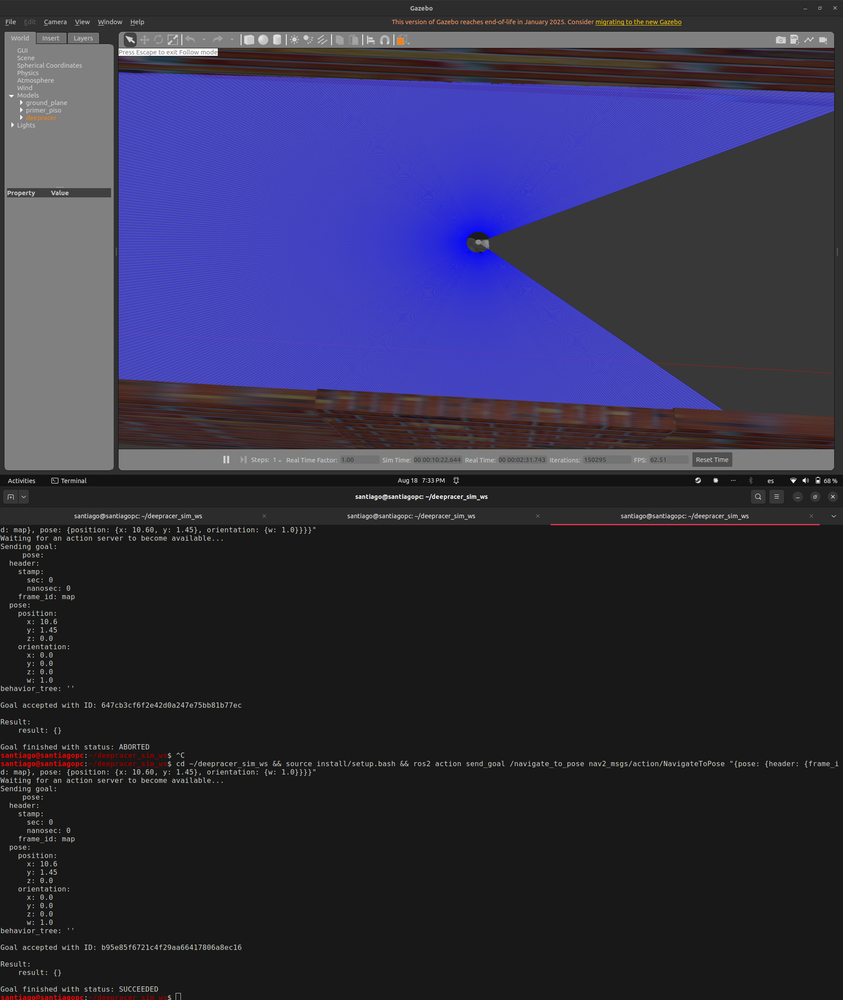

# S19 — `cmd_vel` se interpretaba como ángulo de dirección, no como velocidad angular

**Fecha:** 2026-08-18. **Código base:** `2e28cdb`.
**Cubre:** validación de la maniobra de retorno (dos medios círculos) y el defecto que apareció al medirla.

Objetivo de la sesión: comprobar que el vehículo puede darse la vuelta en el pasillo, porque
sin esa maniobra no hay recorrido de ida y vuelta y el objetivo específico 4 no se puede medir.
La maniobra funciona. Midiéndola apareció un defecto de unidades que estaba degradando todo el
seguimiento de trayectoria desde el inicio del proyecto.

---

## Resultado 1 — la maniobra de dos medios círculos funciona, y ya estaba configurada

No hubo que diseñar nada. `nav2_params_nav_amcl_sim_demo.yaml` ya tenía
`motion_model_for_search: "REEDS_SHEPP"` y `allow_reversing: true`, que es exactamente la
maniobra que planteó el director: un arco en reversa y otro hacia adelante. Nunca se había
probado porque todas las metas validadas hasta S18 quedaban por delante del vehículo.

Prueba 1, arrancando en (25.0, 1.45) mirando al este con la meta en ETM1 (10.60, 1.45), es
decir **detrás**:

| t (s) | x | yaw | marcha |
|---|---|---|---|
| 26.1 | 24.96 | 17° | quieto |
| 27.0 | 24.82 | 47° | reversa |
| 27.6 | 24.77 | 63° | adelante |
| 29.5 | 24.59 | 141° | adelante |
| 30.1 | 24.37 | 165° | adelante |

Arco en reversa de 46°, cúspide, arco hacia adelante de 102°: **148° de giro en 4 s dentro de
una caja de 1,0 × 0,4 m**. El primer `/plan` publicado ya traía 2 cúspides, o sea que el
planificador lo había previsto.

Al llegar hace lo simétrico: entra al destino **de reversa**, usando la marcha atrás para
quedar alineado con el rumbo que pedía la meta en vez de frenar y maniobrar.

## Resultado 2 — el defecto: `angular.z` no significaba lo que Nav2 cree

`geometry_msgs/Twist` define `angular.z` como **velocidad angular en rad/s**. El plugin de
Gazebo lo tomaba como un **ángulo de dirección en radianes**: en
`gazebo_ros_deepracer_drive.cpp` hacía `target_rot_ = _msg->angular.z`, lo saturaba contra
`max_steer_` y lo metía en `tan()`. El propio código se contradecía — el comentario del campo
decía *«Angular velocity in Z received on command (rad/s)»*.

**El código no bastaba como prueba, así que se midió.** Tomando sólo las muestras con la
dirección al tope (donde `angular.z` casi no varía) y comparando la rotación real contra lo
que predice cada interpretación:

| \|v\| | muestras | giro real | si fuera rad/s | si fuera ángulo |
|---|---|---|---|---|
| 0,12 m/s | 41 | 0,42 rad/s | 0,74 | **0,43** |
| 0,20 m/s | 116 | 0,66 rad/s | 0,76 | **0,70** |

Lo decisivo no son los residuos sino la **dependencia con la velocidad**: con el volante
clavado al tope, `angular.z` apenas se movió (0,74 → 0,76) pero la rotación real subió de 0,42
a 0,66 siguiendo a la velocidad. Si `angular.z` fuera una velocidad angular, la rotación no
habría cambiado. Es un volante, no un giróscopo.

**Consecuencia cuantificada.** Nav2 quiere una curvatura κ y publica `angular.z = κ·v`. El
plugin dirigía δ = κ·v radianes, con lo que la curvatura real salía `tan(δ)/L ≈ κ·v/L`: la
ganancia efectiva del volante era **v / 0,164**.

- a 0,5 m/s giraba **3,05 veces más cerrado** de lo pedido → culebreo de ±6° en recta;
- a 0,164 m/s coincidía por casualidad;
- a 0,12 m/s giraba **27 % menos** de lo pedido → no lograba alinearse al estacionar.

La ganancia variaba por un factor de 4 a lo largo del rango de velocidad y el controlador no
lo sabía.

**El mismo defecto estaba en el robot real.** `cmdvel_to_servo_node.py` hacía
`self.target_rot = msg.angular.z` y lo mapeaba a ángulo de servo. Misma convención, mismo
error. Que estuviera igual en los dos sitios es lo único afortunado: no había divergencia
sim/hardware que reconciliar.

## Resultado 3 — la corrección y su validación

Modelo de bicicleta despejado: `δ = atan(wz · L / v)`. Aplicado en el plugin y en el nodo del
robot real. Se quitó además el `copysign` que compensaba a mano el signo en reversa, porque la
fórmula ya lo contempla.

El criterio de aceptación se fijó **antes** de tocar el código, tomando como línea base las dos
corridas ya grabadas. Salida completa en `logs/S19_maniobra_metricas.txt`.

| métrica | P1 antes → después | P2 antes → después |
|---|---|---|
| **Giro real vs comandado (RMS, sin saturación)** | 0,298 → **0,111** rad/s | 0,256 → **0,130** rad/s |
| Volante al tope | 12 % → 15 % | 21 % → 29 % |
| Cúspides ejecutadas vs planificadas | 4 vs 2 → 4 vs 2 | 6 vs 2 → **0 vs 0** |
| **Error real de llegada** | 0,255 → **0,091** m | 0,152 → **0,124** m |
| Tiempo en movimiento | 37,1 → 38,9 s | 17,6 → **13,6** s |
| Error de localización (mediana) | 0,224 → **0,121** m | 0,090 → **0,045** m |
| **Deriva en reposo** | 0,1167 → **0,0154** °/s | 0,0465 → 0,0259 °/s |

El renglón decisivo es el primero: el vehículo gira ahora aproximadamente a la velocidad que
Nav2 le pide, con la mitad de error en las dos corridas. Todo lo demás se deriva de eso.


La misma prueba 1 dibujada (`herramientas/graficar_seguimiento.py`): en azul lo que Nav2 pide,
en rojo lo que el vehículo hace. Antes el rojo se pasa del azul de forma sistemática y entre
t = 50 s y t = 58 s entra en una oscilación que **no está en el comando** —el vehículo se salía
del plan y el controlador corregía a destiempo—; después lo sigue. Los dos paneles comparten
escala a propósito: con una escala por panel la comparación engañaría.

**La deriva en reposo era el mismo defecto.** Venía anotada como defecto abierto sin
cuantificar («hasta 18°»). Con el robot detenido, un `angular.z` residual seguía torciendo el
volante; ahora, por debajo de 1 mm/s la dirección se fuerza a cero. En estas dos corridas bajó
7,6 veces. **El mecanismo se da por explicado; la cifra no.** Una corrida posterior midió
0,1192 °/s con una ventana tres veces más larga, así que la comparación de arriba no está hecha
en igualdad de condiciones (ver más abajo).

### Confirmación independiente, y un defecto nuevo

Se repitió la maniobra una vez más para grabar la evidencia audiovisual, con la meta en ETM1
pero **mirando al oeste** (`z: 1.0, w: 0.0`) en vez de al este. El cambio no es cosmético: con
la meta mirando al este el vehículo tiene que *entrar de reversa* para alinearse, y ahí es donde
pelea con la tolerancia de rumbo; mirando al oeste el volteo sigue siendo obligatorio —la meta
está detrás— pero la llegada es de frente.

| métrica | valor | criterio |
|---|---|---|
| Giro real vs comandado (RMS) | **0,082 rad/s** | < 0,15 ✅ |
| Volante al tope | 7 % | — |
| Cúspides planificadas / ejecutadas | 1 / 3 | ≠ 0 ✅ |
| Rumbo de llegada | −179,7° contra 180° pedidos | **0,3° de error** |
| Error real de llegada | 0,383 m | fuera de los 0,25 declarados |

Es el mejor RMS de las seis corridas y **confirma la corrección en un escenario que no es el que
se usó para validarla**, que es la única forma de que la validación no sea circular.


El plan y el recorrido dibujados sobre el mapa (`herramientas/graficar_plan.py`). La ampliación
es lo que importa: el planificador propuso **una cúspide** y el vehículo la ejecutó. A escala del
pasillo entero la maniobra ocupa un metro de dieciséis y no se distingue, que es exactamente por
qué una captura de pantalla de RViz no servía.

**El defecto que apareció.** Dos corridas previas de esa misma tanda terminaron en `ABORTED` y
`CANCELED`, y el patrón es inconfundible: **80 cúspides ejecutadas contra 2 planificadas**, en
una secuencia de `RE0.2 AD0.2` repetida medio centenar de veces. El vehículo terminó a 164,4° con
la meta en 180°: **15,6° fuera de una tolerancia de 14,32°** (`yaw_goal_tolerance: 0.25` rad).

Hipótesis, no hecho probado: el verificador de meta está en `stateful: True`. Cuando cumple la
tolerancia de posición la **da por buena y deja de comprobarla**, y a partir de ahí solo exige el
rumbo. Un Ackermann no gira sobre su eje, de modo que se pone a maniobrar en el sitio, nunca
cierra los últimos grados y acaba abortando por el `progress checker` (0,5 m en 10 s). Esto ya
figuraba abajo como riesgo —*«pasa por 0,4°»*— pero ahí solo pasaba raspando. **Ahora falla, y
sube de anotación a defecto.**



**Una anomalía que no encaja.** La deriva en reposo de esta corrida fue de **0,1192 °/s**, casi
la de antes de la corrección (0,1167) y siete veces la de después (0,0154). La ventana medida
también es distinta —33 s frente a 5 y 11 s—, así que puede ser un artefacto del asentamiento
del vehículo tras aparecer en el mundo y no una regresión. Queda anotado sin explicar: no se
pide otra corrida para resolverlo hoy, pero **invalida la afirmación de que la deriva bajó 7,6
veces** hasta que se mida con ventanas comparables.

## Resultado 4 — la maniobra de dos medios círculos no es obligatoria

En la prueba 2 corregida el robot **dejó de hacer los dos medios círculos** y salió del hueco
de la escalera en un solo arco en reversa, sin cúspides. No es un fallo. El plan lo muestra:

```
t=35,3   2 cúspides    <- el plan inicial SÍ era la maniobra de dos medios círculos
t=38,4   4 cúspides
t=39,5   0 cúspides    <- replanifica y encuentra una salida sin ninguna cúspide
t=48,7   0 cúspides
```

El robot arranca mirando al este (yaw ≈ 0) y el destino también pide mirar al este. **No hay
cambio neto de orientación que resolver**, y cuando salida y llegada apuntan igual
Reeds-Shepp admite soluciones sin cúspide: basta retroceder describiendo una S. La cúspide sólo
hace falta cuando hay que voltear el vehículo, que es el caso de la prueba 1 (165°) y ahí sigue
ejecutándose.

**Las 6 cúspides de la prueba 2 antes del arreglo no eran la maniobra: eran el síntoma.** El
vehículo giraba más cerrado de lo comandado, se salía del plan y el controlador improvisaba
cúspides para recuperarse.

## Resultado 5 — la localización es el límite, no el control

`SUCCEEDED` se emitió legítimamente en las cuatro corridas, pero el número que importa no es
ese. En la prueba 1 sin corregir, en el instante de `Reached the goal!`:

```
posición verdadera   x = 10,370
lo que Nav2 creía    x = 10,744      (corrección AMCL de +0,374 m)
error que Nav2 midió : 0,144 m   -> dentro de la tolerancia de 0,25
error real           : 0,230 m   -> también dentro, por poco
```

Siete décimas de segundo después la corrección había crecido a 0,593 m. **El error de la
localización era mayor que la tolerancia que la localización decía estar cumpliendo.** Que el
error real cayera dentro fue suerte.

El contraste entre las dos pruebas explica por qué: en el pasillo abierto el error mediano fue
0,224 m y en el extremo este 0,090 m, un factor de 4 con la misma configuración. En un pasillo
recto y largo el LiDAR observa bien la distancia a las paredes y el rumbo, pero **casi no
observa la posición a lo largo del pasillo**: todos los puntos se ven iguales. Cerca del
extremo este hay geometría —el hueco de la escalera, la pared del fondo— que sí la fija.

No es un error de configuración; es una limitación estructural del entorno. La corrección la
redujo (0,224 → 0,121 m) al alimentar al filtro con un movimiento más limpio, pero no la
elimina.

**Decisión metodológica para el objetivo 4:** las métricas de precisión de llegada se reportan
contra `/odom`, que en esta simulación es la pose verdadera de Gazebo
(`model_->WorldPose()`), no contra la estimación de Nav2.

---

## Lo que queda abierto

- **El nodo del robot real no está validado.** La corrección se aplicó a
  `cmdvel_to_servo_node.py` por simetría con el plugin, pero no hay vehículo disponible para
  probarla. Hay que rehacer esta batería sobre hardware antes de darla por buena.
- **RPP no limita la curvatura al radio mínimo del vehículo.** Sigue pidiendo giros de radio
  menor a los 0,284 m físicos; ahora saturan correctamente en vez de sobreactuar, pero el
  seguimiento se degrada en esos instantes. `regulated_linear_scaling_min_radius` sólo frena,
  no limita.
- **El verificador de meta pelea con la restricción Ackermann.** Ya no es que «pase raspando»:
  hay dos corridas abortadas con 80 cúspides de maniobra en el sitio. Hay que decidir entre
  `stateful: False`, ampliar `yaw_goal_tolerance`, o declarar el rumbo de los puntos de interés
  de modo que coincida con la dirección de marcha. **Es el siguiente defecto a atacar** y
  bloquea la campaña de OE4, porque una tasa de éxito medida con este verificador cuenta como
  fallos maniobras que llegaron bien.
- **La deriva en reposo no está cerrada.** Se midió 0,0154 °/s tras la corrección y 0,1192 °/s
  en la corrida de evidencia, con ventanas de duración distinta. Hay que volver a medirla con
  ventanas iguales antes de sostener ninguna de las dos cifras.
- Los bags están en `/tmp` y son efímeros. Se conserva la herramienta
  (`herramientas/analizar_maniobra.py`) y su salida, no los datos crudos.

## Cómo refutar este resultado

Relanzar las dos pruebas y volver a pasar la herramienta:

```
ros2 launch deepracer_bringup nav_amcl_demo_sim.launch.py x:=25.0 y:=1.45 yaw:=0.0
ros2 bag record -o /tmp/v_p1 /plan /odom /cmd_vel /amcl_pose
ros2 action send_goal /navigate_to_pose nav2_msgs/action/NavigateToPose \
  "{pose: {header: {frame_id: map}, pose: {position: {x: 10.60, y: 1.45}, orientation: {w: 1.0}}}}"
python3 herramientas/analizar_maniobra.py /tmp/v_p1 10.60 1.45
```

El resultado queda refutado si el RMS de `giro real vs comandado` vuelve a superar 0,25 rad/s,
o si el error real de llegada empeora respecto a la tabla del Resultado 3.

Manda el goal dentro de los primeros 30 s tras el arranque: con el robot parado más tiempo, la
deriva en reposo mete un desvío inicial que confunde el diagnóstico.

## Criterio de cierre

La maniobra de retorno **queda validada** en los dos escenarios: pasillo abierto (volteo de
165° con cúspide) y salida del hueco de 1,91 m (arco en reversa sin cúspide). El defecto de
conversión de `cmd_vel` **queda corregido y medido** en simulación, y **pendiente de validar**
en hardware.
