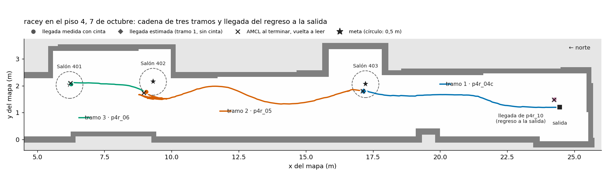
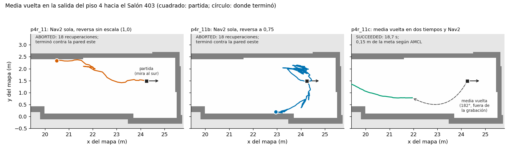
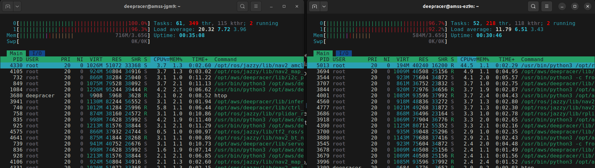
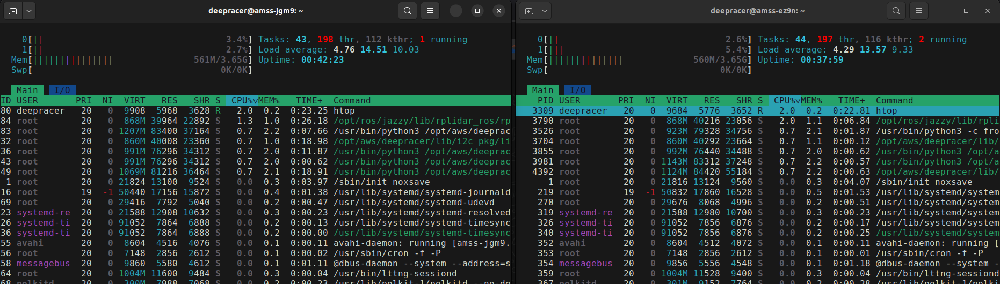

# Cadena del piso 4 con racey y media vuelta en la salida (7 de octubre, tarde)

Primera campaña en el pasillo del piso 4 con toda la cadena del vehículo: Nav2, AMCL, rf2o, la IMU y
el filtro, con `IMU=true` y margen de llegada de 0,5 m (§3.2 y §3.3 de [`PLAN_S26.md`](../PLAN_S26.md)).
Solo corrió `amss-jgm9` (racey), entre las 17:38 y las 18:44. `amss-ez9n` (deepy) quedó en red después
de corregir su dirección (§6), pero se apagó para que un solo vehículo corriera la cadena. El equipo colocó el vehículo, marcó las llegadas en el piso y
midió con flexómetro las que pudo. Claude lanzó las corridas por SSH desde el portátil y analizó las
grabaciones.

Los datos quedan en `~/tesis_evidencia/campo_2026-10-07/` del portátil:

- el registro de cada corrida y su grabación (`campana_p4r_*`);
- el CSV de la campaña, con las columnas de cinta rellenas;
- el registro de carga de la tarjeta;
- las trayectorias en el marco del mapa (`trayectorias_mapa.json`).

## Resultado

1. La cadena de tres tramos (salida → Salón 403 → Salón 402 → Salón 401) llegó en los tres sin que
   nadie tocara el vehículo. Con cinta, la llegada al 401 quedó a 0,06 m de la meta y la del 402 a
   0,45 m. La del 403 no se midió y se estima en 0,26 m. Las tres quedan dentro de los 0,5 m de G-3.
   El 2-oct, sin IMU y con margen de 1,0 m, las llegadas quedaron a 0,57 m y 0,62 m.
2. Con IMU, el filtro sobreestima el avance un 1,9 % en el tramo 2 y un 4,9 % en el tramo 3 (2,7 %
   en los 10,9 m medidos), dentro del 10 % de G-2. AMCL, leída de nuevo al terminar cada corrida,
   quedó más cerca de la cinta: 0,10 m o menos en el avance, 5 cm o menos en lo lateral y 2 cm en
   la llegada a la salida.
3. Con la escala 1,0 racey iba a 1,36 m/s y se pasaba de la meta del 403 unos 0,7 m. Con 0,9 va a
   unos 0,7 m/s. Se dejó 0,9 para racey.
4. Con la misma orden, el motor retrocedía a unas 1,7 veces la velocidad con que avanza. La media
   vuelta de Nav2 en la salida, con 2,5 m de ancho, abortó dos veces contra la pared, también con la
   reversa reducida al 75 %. La media vuelta en dos tiempos (reversa con la dirección a tope y avance
   con la dirección contraria) giró 182°, y después Nav2 llegó al 403 en 18,7 s.
5. La tarjeta no se saturó durante las corridas: el procesador llegó a 83 % como máximo. El 99,9 %
   solo se alcanzó en el arranque de la cadena.

## 1. Escala de velocidad de racey

Con Nav2 navegando a 0,5 m/s, la velocidad real depende solo de la escala del puente. La primera
corrida, `p4r_04`, se hizo con la escala 1,0.

| Corrida | Escala | Velocidad de crucero (mediana de `/odom`) | Avance del filtro | Pasada estimada | Llegada estimada |
|---|---|---|---|---|---|
| p4r_04 | 1,0 | 1,36 m/s | 8,27 m | 0,73 m | 0,85 m de la meta |
| p4r_04b | 0,9 | 0,74 m/s | 7,55 m | ninguna (0,06 m antes) | 0,33 m de la meta |

Ninguna de las dos se midió con cinta: se estiman como el tramo 1 de la §2. El equipo vio a ojo
`p4r_04b` a unos 0,5 m de la posición que daba AMCL, sin medida. Bajar la escala un 10 % redujo la
velocidad casi a la mitad: con 0,9 el puente baja el acelerador de 0,80 a 0,63, porque su reescalado
no es lineal, y la velocidad del motor tampoco es proporcional al acelerador. La escala 0,9 quedó como la de racey en `nav2_mapa_guardado.sh`. La de deepy sigue en
0,85, según la corrida del 2-oct.

## 2. Cadena de tres tramos (§3.2)

`p4r_04c` repitió el tramo 1 desde la salida. `p4r_05` y `p4r_06` siguieron sin tocar el vehículo ni
darle pose.

| Tramo | Corrida | Tiempo | Recuperaciones | Incertidumbre de AMCL al salir | Avance del filtro | Avance de AMCL | Avance real | Error del filtro | Llegada, distancia a la meta | Llegada según AMCL |
|---|---|---|---|---|---|---|---|---|---|---|
| 1 | p4r_04c | 13,5 s | 1 | 0,13 m | 7,60 m | 7,37 m | 7,35 m (estimado) | — | 0,26 m (estimada, de 0,25 a 0,29) | 0,27 m |
| 2 | p4r_05 | 27,8 s | 1 | 0,37 m | 8,24 m | 8,18 m | 8,08 m | +0,16 m (+1,9 %) | 0,45 m (de 0,42 a 0,48) | 0,54 m |
| 3 | p4r_06 | 5,2 s | 0 | 0,62 m | 2,96 m | 2,85 m | 2,82 m | +0,14 m (+4,9 %) | 0,06 m (de 0,03 a 0,11) | 0,08 m |

Cómo se obtuvo cada columna:

- Con cinta se midieron el avance de marca a marca a lo largo del pasillo y la distancia
  del centro del vehículo a las dos paredes. El tramo 3 se desplazó 0,28 m hacia el este, así que su
  avance real es 2,82 m y no los 2,81 m medidos a lo largo.
- El tramo 1 no se midió porque en ese momento no había flexómetro. Se estimó
  corrigiendo los avances del filtro y de AMCL con su error medio en los tramos 2 y 3 (+2,7 % y +1,1 %).
  Los dos dan 7,40 m y 7,29 m, y se tomó la media. Para lo lateral se usó AMCL.
- Como los tramos 2 y 3 se midieron desde la marca anterior, heredan la
  incertidumbre del tramo 1: de ahí los rangos de la columna de llegada.
- En el 402 las dos medidas laterales coinciden con el mapa (1,46 m a
  la pared oeste y 1,56 m a la de las puertas, 3,02 m frente a los 3,07 m del mapa). En el 401 suman
  3,39 m, frente a los 3,19 m del mapa. Se usó la medida a la pared de las puertas, que coincide con
  AMCL a 5 cm. La del ascensor probablemente se tomó a un hueco de la pared.

Lo que muestra la cadena:

- El filtro calculaba que el vehículo se había pasado
  +0,31, +0,39 y +0,09 m de cada meta. Con cinta, el sobrepaso fue de unos +0,08 m (estimado), +0,25 m
  y −0,05 m. La mayor parte del sobrepaso que daba el filtro era su propio error de avance.
- La incertidumbre de AMCL pasó de 0,13 m a 0,37 m y a 0,62 m de un tramo al siguiente,
  porque a lo largo del pasillo hay pocas referencias. Aun así, al terminar cada corrida AMCL se
  corrigió contra el mapa, y el error de llegada no creció de un tramo a otro.
- Cuando Nav2 daba la llegada, AMCL todavía no había actualizado su pose: al volver a leerla se
  movió entre 0,4 m y 0,8 m. La corrida la vuelve a leer antes de
  registrarla, y con ese paso coincide con la cinta.

## 3. Media vuelta en la salida (§3.3)

### 3.1 Regreso del 401 a la salida con Nav2 (`p4r_10`)

`p4r_10` terminó en SUCCEEDED en 62,8 s, con 6 recuperaciones. La media vuelta ocurrió en el tramo
ancho frente al 401 y el 402, entre x = 6,3 m y 9,4 m. Duró unos 45 s, con unas 20 alternancias de
adelante y atrás en golpes de 1 s, y después siguió 18 m hacia el sur sin cortes. La llegada se midió
con cinta: 1,20 m de la pared sur y 1,56 m de la oeste. Eso es 0,20 m antes de la marca de salida y
0,28 m hacia el este, a 0,34 m de la meta. AMCL quedó a 2 cm de esa posición. El filtro calculaba que
se había pasado 0,39 m.

### 3.2 Media vuelta en la salida con Nav2 sola (`p4r_11` y `p4r_11b`)

Desde la llegada de `p4r_10`, mirando al sur, se pidió el Salón 403. Para eso hay que dar media
vuelta en la zona de la salida, de 2,5 m de ancho.

| Corrida | Factor de reversa | Velocidad en reversa (percentil 90 de `/odom`) | Resultado |
|---|---|---|---|
| p4r_11 | 1,0 | 1,40 m/s | ABORTED a los 28,6 s, con 18 recuperaciones. Tocó la pared este y quedó a 3,2 m de la partida (cinta); el filtro midió 4,0 m |
| p4r_11b | 0,75 | 0,48 m/s | ABORTED a los 54,3 s, con 18 recuperaciones. Llegó a girar unos 170°, pero terminó pegado a la pared oeste |

Hacia adelante, con la misma orden, el vehículo va a 0,8 m/s (percentil 90). La reversa más rápida
tiene su origen en el motor: el puente manda la misma magnitud de acelerador en los dos sentidos. Por
eso bajar la velocidad de reversa en Nav2 no la cambia, y el puente convierte en el mismo escalón
cualquier orden por debajo de 1,2 m/s. Para corregirlo se añadió al puente el parámetro
`escala_reversa`, que multiplica el acelerador solo en marcha atrás (§5).

Con 0,75, cada corrección en reversa recorrió de 0,1 m a 0,3 m, frente a los 1,8 m del primer golpe
de `p4r_11`. La maniobra falló por otra causa:

- En los primeros 20 s, Nav2 alternó hacia adelante girando en un sentido y hacia atrás girando en el
  contrario, de modo que el rumbo no salió de ±10°. Los planes suponen un radio de giro de 0,35 m que
  el vehículo no alcanza, y Nav2 vuelve a planificar cada segundo desde la pose nueva, con una
  maniobra distinta cada vez.

### 3.3 Media vuelta en dos tiempos (`p4r_11c`)

Desde la misma marca, mirando al sur, se ejecutó
[`herramientas/media_vuelta.py`](../../herramientas/media_vuelta.py) con `--pose 24.25 1.49 0.0`. La
herramienta hace la maniobra en dos tiempos y cierra el giro sobre el rumbo del filtro, cuya IMU midió
+90,17° en un giro de 90° el 5-oct:

1. Reversa con la dirección a tope hasta 80°, hacia la pared oeste, donde había 1,56 m.
2. Avance con la dirección contraria hasta 170°.

| Tiempo | Giro | Recorrido | Duración | Radio (recorrido ÷ ángulo) |
|---|---|---|---|---|
| Reversa | +93,7° | 2,13 m | 5,2 s | 1,30 m |
| Avance | +88,3° | 1,21 m | 4,4 s | 0,79 m |
| Total | 181,9° | | | |

El vehículo quedó mirando al norte, a unos 0,7 m de la pared oeste según AMCL. Desde ahí, `p4r_11c`
llegó al 403 en SUCCEEDED, en 18,7 s y con 1 recuperación, a 0,15 m de la meta según AMCL. Esa llegada
no se midió con cinta.

Los radios incluyen lo que el vehículo rueda al soltar y salen de la odometría. Hay que confirmarlos
con cinta antes de ponerlos en el planificador (§3.1 del plan). Los dos superan los 0,35 m que supone
hoy `minimum_turning_radius`.

## 4. Carga de la tarjeta

Datos de [`herramientas/registrar_carga.py`](../../herramientas/registrar_carga.py): 869 muestras en
73 min, con toda la cadena cargada (Nav2, AMCL, rf2o, IMU, filtro, puente y grabador).

| | Media | Percentil 95 | Máximo |
|---|---|---|---|
| Procesador, % de la tarjeta (100 = los dos núcleos) | 49 % | 88 % | 99,9 % (17:33, arranque) |
| Memoria usada, de 3740 MB | 1116 MB | 1208 MB | 1235 MB |
| Temperatura | 38 °C | 41 °C | 42 °C |

Durante el tramo 2 el procesador estuvo entre 78 % y 80 %, y durante la media vuelta de `p4r_10`
promedió 74 % con un máximo de 83 %. Por grupo, en porcentaje de un núcleo:

- Nav2: 33 % de media y 101 % de máximo en el arranque.
- rf2o: 21 %.
- AMCL: 7 %.
- IMU: 6 %.
- Filtro: 4 %.

Desde la mañana, `nav2_mapa_guardado.sh` detiene doce procesos de AWS que la cadena no usa. Con eso,
la tarjeta en reposo bajó del 21–34 % al 8–10 % (commit `69421e1`).

En el ensayo de la mañana, sin mover los vehículos, se miró la carga con `htop` en los dos a la vez:

- A las 11:21, con la cadena arrancando, los dos núcleos estaban entre el 92 % y el 100 % en los dos
  vehículos. La carga media de 1 min era de 20,3 en racey y de 11,8 en deepy, con 716 MB y 584 MB de
  memoria.
- A las 11:28, con la cadena detenida, los núcleos bajaron al 3–5 %, con 561 MB y 560 MB.

El arranque satura la tarjeta durante unos minutos, en buena parte por la tabla que el planificador
precalcula. Después la carga se estabiliza alrededor del 50 %, como en la tarde.

## 5. Cambios en el código

Todos los cambios entraron en el commit `1927614`:

- `cmdvel_to_servo_node.py`: parámetro `escala_reversa`, que multiplica el acelerador solo en
  marcha atrás. Por defecto vale 1,0, el comportamiento de antes, y se ajusta sin reiniciar el puente.
  La prueba [`prueba_mapeo_servo.py`](../../Robot/aws-deepracer/deepracer_nodes/cmdvel_to_servo_pkg/test/prueba_mapeo_servo.py)
  lo cubre (27 de 27).
- `nav2_mapa_guardado.sh`: escala y escala de reversa de cada vehículo. racey usa 0,9 y 0,75;
  deepy, 0,85 y 1,0, con la reversa sin medir.
- `media_vuelta.py`: la maniobra de la §3.3. Se detiene sola si el rumbo va al revés, si un tiempo
  pasa de 1,8 m o de 6 s, o con Ctrl-C.
- `calibrar_reversa.py`: empujones hacia adelante y hacia atrás con varios factores, medidos con
  `/odom`. No se usó en campo: el factor 0,75 lo eligió el equipo directamente.

## 6. Incidencias

1. Al encenderla, deepy tomó la dirección 192.168.10.11 del servidor DHCP del
   FiberHome, que comparte la red CLARO_WIFIA40 con el del router. Se le fijó a mano la 192.168.0.102
   y se reinició `deepracer-core`. Sin ese reinicio, los nodos se descubren pero no entregan datos.
   Apagar el DHCP del FiberHome queda a cargo de Jonny
   ([`TOPOLOGIA_RED.md`](../TOPOLOGIA_RED.md)).
2. No había flexómetro en el tramo 1, así que ese tramo y las dos corridas de la escala (§1) quedaron
   estimados.
3. En el 401, la medida al ascensor no cuadra con el ancho del mapa (§2).
4. Las grabaciones empiezan antes de que AMCL reciba la pose de salida, de modo que sus
   primeros puntos en el marco del mapa están en el marco anterior. Para las figuras, las
   trayectorias se tomaron desde el primer plan de Nav2.
5. En `p4r_11` el vehículo tocó la pared este.

## 7. Pendiente

1. Deepy: copiarle el puente nuevo y las dos herramientas, medir su reversa y correr su cadena
   (`p4d_03` a `p4d_05`, escala 0,85).
2. Radio de giro: medirlo con cinta (§3.1 del plan) y ponerlo en `minimum_turning_radius`.
3. Media vuelta en el sistema: que el agente haga la media vuelta en dos tiempos antes de llamar a
   Nav2 cuando la meta queda detrás del vehículo. Es una propuesta, todavía sin diseño.
4. Videos: el equipo sube los de las corridas y se enlazan aquí.
