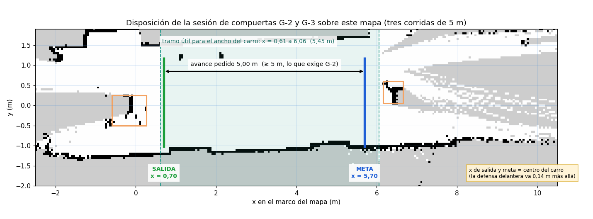
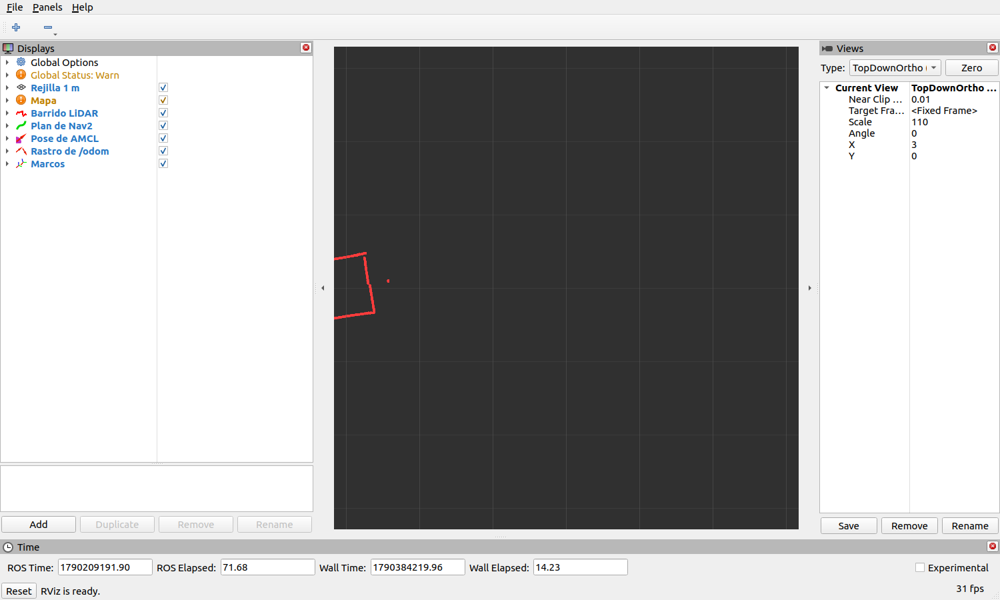
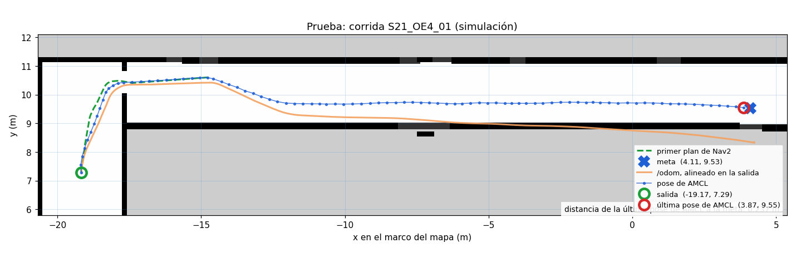

# Guía — sesión de compuertas G-2 y G-3: navegación con Nav2 sobre el vehículo real

**Redactada:** 2026-09-25 (S24).
**Para quién:** cualquiera que clone el repositorio. No hace falta haber estado en ninguna sesión
anterior: todo lo que se necesita está aquí o enlazado desde aquí.
**Vehículo:** `amss-ez9n`, que en las últimas sesiones ha tenido la IP **`192.168.0.102`** por DHCP.
Si hoy tiene otra, sustitúyela en todas las órdenes; `ssh deepracer@<ip> hostname` debe contestar
`amss-ez9n`. Con el otro vehículo también vale, copiando antes los ficheros: ver §0.2.

**Qué contesta, con tres corridas:**

| Pregunta | Criterio | Fuente |
|---|---|---|
| **G-2** · ¿cuánto se equivoca la odometría? | error ≤ 10 % sobre un recorrido **medido** de ≥ 5 m | [`ACTA_GO_NOGO.md`](ACTA_GO_NOGO.md):104 |
| **G-3** · ¿llega el vehículo adonde se le manda? | llegada verificada contra `/odom`, **no** contra el `SUCCEEDED` de Nav2 | [`ACTA_GO_NOGO.md`](ACTA_GO_NOGO.md):105 |
Las dos son del corte **C-1 del viernes 2 de octubre**: si no se alcanzan, el acta revierte a NO-GO.

> **Corregido el 2026-09-25.** Una versión anterior de esta guía decía que estas corridas contaban
> para **RF-27**. Es falso: RF-27 pide que la demostración física *ejecute el protocolo completo*
> —los dos carros, el coordinador y el relevo entre pisos—, y una corrida de un solo carro en recta no
> lo es. Por eso esto dejó de ser una campaña de 5 a 10 corridas: son **tres**, y cierran compuertas.
> El camino al sistema real está en [`PLAN_S25.md`](PLAN_S25.md).

**Esta guía y [`GUION_NAVEGACION_USTA.md`](GUION_NAVEGACION_USTA.md) son complementarias.** Esta
navega sobre el mapa que el propio carro construyó, en un tramo encajonado, y mide G-2 y G-3. La de
Jonny navega el edificio sobre el mapa **derivado del modelo de Gazebo**, y su primer bloque es
validar con flexómetro que el modelo se parece al edificio (criterio ≤ 2 %). Comparten el arranque:
[`nav2_mapa_guardado.sh`](../herramientas/nav2_mapa_guardado.sh).

---

## 0. Antes de nada: qué está probado y qué no

Esta tabla va primero porque es lo que decide cuánto fiarse de cada paso.

| Pieza | Estado | Dónde se probó |
|---|---|---|
| Nav2 + AMCL sobre mapa guardado, en el vehículo | **funciona, una vez**, arrancado a mano | Jonny, 2026-09-24: [`S24_nav2_navegacion_mapa_guardado.md`](Evidencia/S24_nav2_navegacion_mapa_guardado.md) |
| [`nav2_mapa_guardado.sh`](../herramientas/nav2_mapa_guardado.sh), de Jonny: arranca toda la pila en el orden correcto | codifica la secuencia **que sí funcionó a mano** el 24-sep; como script, su commit no registra ejecución contra el vehículo | 2026-09-25, lectura del código; §4.1 |
| [`corrida_nav2.py`](../herramientas/corrida_nav2.py): pose inicial, meta, espera, registro | **probado contra Nav2 real en Gazebo**: 4 corridas y 3 guardas; **nunca contra el vehículo** | 2026-09-25, §9 de esta guía |
| [`correr_corrida_nav2.sh`](../herramientas/correr_corrida_nav2.sh): la corrida con su bag | sintaxis comprobada; la pieza que graba ([`lanzar_bag.inc`](../herramientas/lanzar_bag.inc)) **sí**, en el vehículo | 2026-09-24 |
| [`zona_libre_mapa.py`](../herramientas/zona_libre_mapa.py): dónde se puede pedir una meta | **probado** sobre el mapa real del pasillo | 2026-09-25 |
| [`ver_bag_rviz.sh`](../herramientas/ver_bag_rviz.sh): ver la corrida en RViz después | **probado** con un bag real de Jazzy | 2026-09-25 |
| [`dibujar_corrida_nav2.py`](../herramientas/dibujar_corrida_nav2.py): imagen de la corrida | **probado** con un bag de la campaña OE4; lectura de bags de Jazzy comprobada | 2026-09-25 |
| [`analizar_campana_nav2.py`](../herramientas/analizar_campana_nav2.py): G-2 y G-3 del CSV | **probado** con valores conocidos, cuentas verificadas a mano | 2026-09-25 |
| **Ver el vehículo en vivo desde el portátil** | **no funciona, y está medido** | §6.2 |

Lo que se deduce: **la primera corrida de la primera campaña es también la validación del script
de arranque y de la herramienta sobre hardware.** Si algo falla ahí, no es un fallo de la campaña:
es el ensayo que faltaba. Está previsto en el §4.1.

### 0.1 · El mapa sobre el que se navega

La campaña corre sobre el mapa que el vehículo construyó conduciendo 6 m el 2026-09-24
([`S24_mapeo_6m_hardware.md`](Evidencia/S24_mapeo_6m_hardware.md)), el mismo sobre el que navegó
Jonny:


Tres cosas del mapa que mandan en todo lo que sigue:

- **El pasillo mide 2,70 m** entre muros: sur en `y = −1,10`, norte en `y = 1,60`.
- **Hay dos objetos aislados sobre el eje**, casi con seguridad las dos cajas que acotaban el tramo:
  uno entre `x = −0,59` y `0,26`, otro entre `x = 6,16` y `6,66`. «Casi con seguridad» porque se
  deduce del mapa, no se apuntó en el sitio.
- **El 71,7 % del mapa es desconocido** (gris). El planificador corre con `allow_unknown: false` y
  no planifica por ahí. Una meta que cae en gris aborta **sin decir por qué** — le pasó a Jonny
  con una meta en `x = 8,0`.

### 0.2 · El otro vehículo

Los dos vehículos tienen Nav2 1.3.13, `slam_toolbox` 2.8.5 y rf2o desde la nivelación del 24-sep
([`GUION_NAV2_HARDWARE.md`](GUION_NAV2_HARDWARE.md) §0). Lo que **no** tienen los dos es lo que esta
guía añade a `~/tesis/`: la copia del §3.1 va **a los dos**, aunque la campaña corra en uno. Es
regla del proyecto desde el 24-sep: **todo cambio en un vehículo se aplica a los dos en la misma
sesión**, porque un procedimiento que depende de algo instalado en uno solo falla en el otro, y
falla tarde, cuando ya se está midiendo. **Y solo uno encendido durante la
campaña**: con los dos vivos, cada bag recoge también el LiDAR del otro, intercalado y sin avisar.

> Una versión anterior de esta guía y el commit `e990a72` decían que `amss-jgm9` no tenía esos
> paquetes. Era falso; se había afirmado sin comprobarlo en el vehículo.

---

## 1. Cómo se dispone la campaña



**Por qué estas cifras y no otras.** Sale de medir el mapa con
[`zona_libre_mapa.py`](../herramientas/zona_libre_mapa.py):

```bash
python3 herramientas/zona_libre_mapa.py Documentos/Evidencia/S24_mapa_pasillo6m_HARDWARE.yaml
```

```
tramos libres en esa franja:
   x =  -0.04  a    0.21   (0.30 m)
   x =   0.31  a    6.36   (6.10 m)
TRAMO UTIL (el mas largo, menos 0.30 m a cada lado):
   salida no antes de x = 0.61
   meta no despues de x = 6.06
   AVANCE MAXIMO: 5.45 m
```

La herramienta exige libre **una franja del ancho del carro** (0,30 m), no una sola línea: la
primera versión miraba una línea y daba el tramo útil hasta 6,21, pero la caja del fondo empieza en
`y = 0,05` y el carro, de 0,19 m de ancho, la rozaría. Con 5,45 m disponibles caben **5,00 m de
avance** —lo que pide G-2— con 0,09 m de holgura por la salida y 0,36 m por la meta: **salida en
`x = 0,70`, meta en `x = 5,70`**.

> **La meta de Jonny estaba en 5,50 y el carro se paró en 5,84**, a 0,22 m del borde de lo útil.
> Con la tolerancia actual un carro que se pasa 0,4 m puede acabar fuera del mapa libre en la
> siguiente corrida si la meta se acerca más al fondo. No la acerques.

---

## 2. Preparar el sitio

| | |
|---|---|
| **Objetivo** | Que el pasillo real se parezca al mapa: AMCL localiza emparejando el barrido con el mapa, y si el sitio cambió no empareja. |
| **Qué hacer** | (1) Si hay cajas, ponlas donde indica el mapa: **caras interiores a unos 5,90 m** una de otra (de `x ≈ 0,26` a `x ≈ 6,16`). La de salida **atraviesa** el eje del recorrido (de `y = −0,50` a `0,25`); la del fondo queda **al norte** de él (de `y = 0,05` a `0,60`). (2) Marca con cinta el **eje del recorrido**: **1,10 m del muro sur**, que es `y = 0` en el mapa. (3) Marca con cinta dos líneas transversales **separadas 5,00 m exactos, medidos con flexómetro**: la de salida y la de meta. |
| **Dónde van las líneas** | Donde quedará la **defensa delantera**: la salida a 0,84 m del origen del mapa y la meta a 5,84. En la práctica: con el carro en su sitio de salida (§5.1), la línea de salida va bajo la defensa delantera, y la de meta 5,00 m más allá. |
| **Si no se puede reproducir el sitio** | Se vuelve a mapear con [`mapear_conduciendo.sh`](../herramientas/mapear_conduciendo.sh) siguiendo [`GUION_CAMPO_PISO2.md`](GUION_CAMPO_PISO2.md), y se recalculan salida y meta con `zona_libre_mapa.py` sobre el mapa nuevo. |
| **Cierre** | Líneas de salida y meta en el suelo, y su separación **anotada con la cifra que dio el flexómetro**, no con «5». |

> **Por qué 5,00 m medidos y no «la distancia entre las cajas».** El 2026-09-25 se dio por hecho
> que el carro de Jonny había avanzado «5 m» porque llegó cerca de la caja. No es una medida: G-2
> pregunta exactamente por la diferencia entre lo que dice la odometría y lo que hizo el carro, y
> esa diferencia es de centímetros. Una cifra estimada no la puede contestar.

---

## 3. Preparar el vehículo, desde el portátil

### 3.1 · Copiar lo que hace falta

Todo va a **`~/tesis/`** en el vehículo, que sobrevive a un reinicio. **No a `/tmp`**: el carro se
reinició solo una vez en mitad de una sesión y se llevó todo lo que había allí.

```bash
ssh deepracer@192.168.0.102 "mkdir -p ~/tesis"
```

```bash
scp -r Robot/aws-deepracer/deepracer_bringup/launch/nav2_hardware.launch.py Robot/aws-deepracer/deepracer_bringup/config/nav2_params_jazzy.yaml Robot/aws-deepracer/deepracer_bringup/config/slam_toolbox.yaml Robot/aws-deepracer/deepracer_description/models/urdf/deepracer_hardware.urdf Robot/aws-deepracer/deepracer_bringup/behavior_trees Documentos/Evidencia/S24_mapa_pasillo6m_HARDWARE.yaml Documentos/Evidencia/S24_mapa_pasillo6m_HARDWARE.pgm herramientas/corrida_nav2.py herramientas/zona_libre_mapa.py herramientas/correr_corrida_nav2.sh herramientas/lanzar_bag.inc deepracer@192.168.0.102:~/tesis/
```

| | |
|---|---|
| **Esperado** | Diez ficheros más la carpeta `behavior_trees`, sin errores. |
| **Por qué va `slam_toolbox.yaml` si no se usa SLAM** | El launch lo exige siempre, y si falta aborta antes de arrancar nada. Es una rigidez del launch, no una necesidad de la campaña. |
| **Cierre** | `ssh deepracer@192.168.0.102 "ls ~/tesis ~/tesis/behavior_trees"` lista los diez y los dos árboles `ackermann_*.xml`. |
| **Y luego, al otro carro** | La misma orden con la IP de `amss-jgm9`. La campaña corre en uno, pero los dos quedan con los mismos ficheros (§0.2). Si está apagado, queda anotado como pendiente. |

### 3.2 · Comprobar lo instalado

```bash
ssh deepracer@192.168.0.102 "source /opt/ros/jazzy/setup.bash; source ~/nav_ws/install/setup.bash; source ~/coordinacion_ws/install/setup.bash; ros2 pkg list 2>/dev/null | grep -E '^(nav2_amcl|nav2_map_server|nav2_bt_navigator|rf2o_laser_odometry|cmdvel_to_servo_pkg)$'"
```

| | |
|---|---|
| **Esperado** | Las cinco líneas. |
| **Si falta rf2o** | `ssh deepracer@192.168.0.102 "source /opt/ros/jazzy/setup.bash && cd ~/nav_ws && colcon build --symlink-install --packages-select rf2o_laser_odometry"` — el fuente se copia antes desde `~/deepracer_sim_ws/src/rf2o_laser_odometry`, como se hizo el 2026-09-23. Tarda 3 min. |
| **Si falta Nav2** | `ssh deepracer@192.168.0.102 "sudo -n apt-get update && sudo -n DEBIAN_FRONTEND=noninteractive apt-get install -y ros-jazzy-navigation2 ros-jazzy-nav2-bringup"`. **El `update` primero no es opcional**: sin él el índice del carro pide versiones que ya no existen y todo acaba en `404 Not Found`. Pasó el 2026-09-23. |

---

## 4. Arrancar la pila

**Todo corre como `root`** en el vehículo, y no por capricho: `deepracer-core` corre como `root`, y
Fast DDS no empareja por memoria compartida entre usuarios distintos. Un proceso que corra como
`deepracer` **descubre los tópicos pero no recibe nada, y no da ningún error**. Es el fallo más caro
que ha tenido este proyecto sobre hardware.

### 4.1 · Una orden, desde el portátil

El arranque lo hace [`nav2_mapa_guardado.sh`](../herramientas/nav2_mapa_guardado.sh), de Jonny.
Codifica **la secuencia que le funcionó a mano la noche del 24-sep**, con el orden que resolvió el
defecto que más costó: si los costmaps se configuran antes de que el mapa esté publicado, la capa
estática queda vacía y el planificador aborta con `"Start occupied"` en **cualquier** meta.

```bash
CARRO=192.168.0.102 MAPA=/home/deepracer/tesis/S24_mapa_pasillo6m_HARDWARE.yaml POSE_X=0.70 bash herramientas/nav2_mapa_guardado.sh   # ruta fija del vehículo
```

`MAPA` va con la ruta absoluta **del vehículo**, no del portátil: el script la pasa como
`yaml_filename:=…`, y ahí la tilde no se expande. Requiere entrar por `ssh` sin contraseña
(`ssh-copy-id deepracer@192.168.0.102`, una sola vez).

Lo que hace, en este orden, y comprobando cada paso antes del siguiente:

| # | Qué | Por qué ahí |
|---|---|---|
| 0 | mata cualquier resto de una sesión anterior | dos publicadores de lo mismo se pisan sin avisar |
| 1 | comprueba que el LiDAR publica | sin barridos no hay nada que hacer |
| 2 | arranca el puente `cmdvel_to_servo_node` y pone la escala a **0,9** | el launch no lo arranca; sin él Nav2 planifica y el carro no se mueve, sin error |
| 3 | `map_server` y lo **activa**, esperando a verlo activo | tiene que estar activo **antes** de los costmaps |
| 4 | AMCL y lo **activa** | con `use_sim_time` falso y `scan_topic` del carro |
| 5 | el launch con `slam:=false nav:=true`, y espera 55 s | ahora sus costmaps sí encuentran `/map` |
| 6 | la pose inicial en (`POSE_X`, 0) y el estado de los seis nodos | |

**Esperado al final:** `map_server ACTIVO`, `amcl ACTIVO`, los seis nodos en `label='active'`,
`alguien escucha /cmd_vel` y `CADENA LISTA`. Si algo falla, el propio script dice en qué paso y dónde
mirar el registro. **No manda la meta**: ese es el instante en que el carro se mueve solo, y lo
dispara una persona mirándolo. `--estado` enseña qué hay vivo; `--parar` lo mata todo.

> **Su commit no registra que el script, como script, se haya ejecutado ya contra el vehículo**; lo
> que está probado es la secuencia manual que codifica. Si es la primera vez que se usa, esta
> orden es también su validación: anota si salió a la primera o qué hubo que tocar.

*Nota de método.* El 2026-09-25 se escribió en paralelo una segunda forma de hacer lo mismo —un modo
`mapa:=` dentro del launch, que lanzaba Nav2 con un retraso fijo de 10 s—. **Se retiró antes de
publicarse** en favor de este script: los dos codificaban las mismas correcciones, pero este
**ordena por comprobación** y no por tiempo, y dos formas de arrancar lo mismo son justo lo que una
guía no puede tener.

### 4.2 · La velocidad: el script pone 0,9, y la campaña puede querer menos

La observación de la navegación del 24-sep fue que el carro **iba demasiado rápido**, y la precisión
de llegada falló por lo mismo: se aproxima a la meta sin poder frenar antes. Lo que fija la
velocidad real es `max_speed_pct`, que se cambia en caliente. Para toda orden de Nav2 entre 0,40 y
1,19 m/s, el `throttle` que llega al motor es:

| `max_speed_pct` | `throttle` | Lo que se sabe de él |
|---|---|---|
| **0,68** (de fábrica) | **0,4247** | **movió `amss-ez9n` 6 m el 2026-09-24**, tres corridas y 3227 órdenes, a 0,14–0,26 m/s reales ([`S24_mapeo_6m_hardware.md`](Evidencia/S24_mapeo_6m_hardware.md) §3) |
| 0,75 | 0,4750 | sin medir |
| 0,80 | 0,5185 | sin medir |
| **0,90** (el del script) | **0,6327** | el de la navegación del 24-sep, probablemente; es la que se percibió rápida |

Calculado ejecutando la función real del nodo, que reproduce exactamente el 0,4247 medido en el
servo.

> **Hay un desacuerdo escrito, y se deja a la vista en vez de resolverlo en silencio.** El script
> y [`GUION_NAVEGACION_USTA.md`](GUION_NAVEGACION_USTA.md) §3.1 dicen que con 0,68 el carro **no
> arranca**, apoyándose en la medida del 22-sep —«el 0,50 lo mueve, apenas»—. El 24-sep, con 0,68,
> **anduvo 6 m tres veces**. Las dos cosas son medidas; lo que dicen juntas es que **el umbral de
> arranque de este carro no es estable**, y la batería es el primer sospechoso.

**Recomendación para la campaña:** después del script, bajar a **0,68**, que es la más lenta que se
sabe que mueve el carro:

```bash
ssh deepracer@192.168.0.102 "sudo -n bash -c 'source /opt/ros/jazzy/setup.bash && source /opt/aws/deepracer/lib/setup.bash && ros2 service call /set_max_speed deepracer_interfaces_pkg/srv/NavThrottleSrv \"{throttle: 0.68}\"'"
```

Esperado: `NavThrottleSrv_Response(error=0)`. Que ir más despacio reduzca el error de llegada **es
una hipótesis**, no una medida: es una de las cosas que la campaña mide. Si con 0,68 el carro no
arranca —`corrida_nav2.py` dirá que Nav2 mandó órdenes y `/odom` no avanzó—, sube a 0,75 y luego a
0,80. **Anota el valor. No lo cambies a mitad de campaña**: si hay que cambiarlo, es otra campaña,
con otro CSV.

### 4.3 · Dos comprobaciones antes de mover nada

**1. Que el planificador puede llegar a la meta, sin mover el carro.** Es el método de Jonny que
más tiempo ahorra, y el script lo imprime al terminar. Para la meta de la campaña:

```bash
ssh deepracer@192.168.0.102 "sudo -n bash -c 'source /opt/ros/jazzy/setup.bash && ros2 action send_goal /compute_path_to_pose nav2_msgs/action/ComputePathToPose \"{goal: {header: {frame_id: map}, pose: {position: {x: 5.70, y: 0.0, z: 0.0}, orientation: {w: 1.0}}}, use_start: false}\"'"
```

`SUCCEEDED` = el planificador puede. `ABORTED` = mira el registro del `planner_server` que indica el
script; `"Start occupied"` quiere decir que la salida cae en celda no libre.

**2. Que los costmaps escuchan el LiDAR del carro.** Es condición de **seguridad**: sin ella el
vehículo no ve obstáculos que no estén en el mapa.

```bash
ssh deepracer@192.168.0.102 "sudo -n bash -c 'source /opt/ros/jazzy/setup.bash && ros2 topic info /rplidar_ros/scan --verbose | grep -E \"Subscription count|Node name\"'"
```

| | |
|---|---|
| **Esperado** | Entre los suscriptores, además de `rf2o_laser_odometry` y `amcl`, los nodos de los dos costmaps: `local_costmap` y `global_costmap`. |
| **Si faltan** | El carro no ve obstáculos nuevos. **Pasillo despejado de gente** hasta resolverlo. |
| **Por qué hay que mirarlo y no darlo por hecho** | Hay dos lecturas enfrentadas. [`GUION_NAVEGACION_USTA.md`](GUION_NAVEGACION_USTA.md) §2.2 dice que el 24-sep el costmap global escuchaba `scan`, apoyándose en la línea de log `Subscribed to Topics: scan`. Pero esa línea **imprime el nombre de la fuente de observación, no el tópico**: en la simulación el YAML dice `topic: /scan`, con barra, y el log dice `scan`, sin ella. Y ejecutando en el portátil la reescritura que hace el launch, **los dos costmaps quedan con `topic: /rplidar_ros/scan`** — y el script arranca Nav2 por el launch. Lo esperable, entonces, es que escuchen bien. Lo que lo zanja es esta orden, en el carro. |

---

## 5. Una corrida

**A partir de aquí el carro se mueve. Aparta a la gente del pasillo**, al menos hasta que la
segunda comprobación del §4.3 haya enseñado a los dos costmaps escuchando el LiDAR del carro.

### 5.1 · Colocar el vehículo

- **Centro del carro en el eje del recorrido** (1,10 m del muro sur), apuntando hacia la meta.
- **Defensa delantera sobre la línea de salida.**
- Recto, a ojo. Nav2 corrige rumbo, pero una salida torcida gasta metros en corregirse.

### 5.2 · Correr

**Terminal 4:**

```bash
ssh deepracer@192.168.0.102 "sudo -n bash ~deepracer/tesis/correr_corrida_nav2.sh c1_01 --salida 0.70 0.0 0.0 --avance 5.0 --mapa ~deepracer/tesis/S24_mapa_pasillo6m_HARDWARE.yaml --csv ~deepracer/campana_c1.csv"
```

`c1_01` es el identificador: campaña 1, corrida 1. **Cada corrida lleva uno distinto**; el guion se
niega a pisar un bag existente. `--salida` va **en todas las corridas**, también la primera: al
devolver el carro a mano a la línea de salida, AMCL sigue creyendo que está donde paró la corrida
anterior.

Lo que hace, en orden: publica la pose inicial, espera a que AMCL converja, fija la meta 5,00 m por
delante **de donde AMCL dice que salió**, comprueba que la meta cae en zona libre del mapa, la manda,
espera, comprueba que el vehículo quedó quieto, obliga a AMCL a corregirse, y escribe la fila.

**Qué debe salir** — la salida real de la prueba en Gazebo del §9, con el mismo código:

```
== pose inicial: x=-19.17 y=9.19 yaw=1.57 ==
== esperando a AMCL (sigma < 0.20 m) y a /odom ==
   salida AMCL: x=-19.182 y=9.192 yaw=1.569  (sigma 0.141 m)
== meta: x=-19.165 y=10.200 yaw=1.57  (avance pedido 1.008 m, tope 90.0 s) ==
== comprobando que el vehiculo esta quieto ==
   quieto: 0.001 m en 2 s
== forzando a AMCL a corregir su pose antes de leerla ==

estado Nav2          : SUCCEEDED   (2.6 s, 0 recuperaciones)
avance pedido        : 1.008 m
avance segun AMCL    : 0.856 m
avance segun /odom   : 0.873 m
error de llegada AMCL: 0.189 m   (tolerancia de Nav2: 0,25)
error longitudinal segun /odom: -0.135 m   (+ se paso, - se quedo corto)
```

**Por qué la herramienta fuerza a AMCL al llegar.** AMCL solo se corrige cada 0,25 m de
movimiento, así que al parar su pose puede estar **atrasada hasta 25 cm**. En la primera prueba en
Gazebo, sin esa corrección, Nav2 dijo `SUCCEEDED`, AMCL daba 0,309 m de error y `/odom` decía que
el robot se había quedado 0,10 m corto: AMCL y `/odom` discrepaban 20 cm. Con la corrección
forzada, **1,7 cm**.

### 5.3 · Medir con cinta, ANTES de tocar el carro

Es la parte que ninguna herramienta puede hacer, y sin la cual la corrida no cuenta para G-2 ni
para G-3:

| Medida | De dónde a dónde | Signo |
|---|---|---|
| **Avance real** | de la línea de salida a la defensa delantera | — |
| **Error longitudinal** | de la línea de meta a la defensa delantera | **+** si la pasó, **−** si se quedó corto |
| **Desvío lateral** | del centro del carro a la cinta del eje | — |

Anótalo **en papel en el momento**, con el identificador de la corrida. Al volver se pasa a las
tres columnas `CINTA_*` del CSV (§7).

### 5.4 · Qué más anotar por corrida

| Campo | De dónde |
|---|---|
| Identificador y hora | la orden y el reloj |
| Batería | `ssh deepracer@192.168.0.102 "sudo -n bash -c 'source /opt/ros/jazzy/setup.bash && source /opt/aws/deepracer/lib/setup.bash && ros2 service call /i2c_pkg/battery_level deepracer_interfaces_pkg/srv/BatteryLevelSrv \"{}\"'"` |
| `max_speed_pct` usado | el del §4.2 |
| Estado de Nav2 y si hubo recuperaciones | la pantalla |
| Las tres de cinta | el flexómetro |
| Lo que se vio | si corrigió rumbo, si dudó, si rozó algo |

> **La batería no es un detalle.** El 24-sep la misma orden dio 0,261 m/s y 0,149 m/s en dos
> corridas seguidas, un factor de 1,75 sin explicar, y la batería es el primer sospechoso.

### 5.5 · Devolver el carro y repetir

A mano, a la línea de salida, en la misma postura. Siguiente corrida con el identificador siguiente
(`c1_02`, `c1_03`) y **la misma orden**. **Tres corridas** bastan para las compuertas; más corridas
de un solo carro no aportan a RF-27, que pide el protocolo completo.

**Después de la primera corrida, antes de seguir: mírala** (§6.1). Es la única forma de saber que
AMCL localiza bien antes de gastar las otras dos.

---

## 6. Verlo

### 6.1 · En RViz, reproduciendo el bag — **probado**

```bash
mkdir -p ~/tesis_evidencia/campana_c1 && scp -r deepracer@192.168.0.102:'~/campana_c1_01' ~/tesis_evidencia/campana_c1/
```

```bash
herramientas/ver_bag_rviz.sh ~/tesis_evidencia/campana_c1/campana_c1_01
```

Adapta el bag de Jazzy a Humble sin tocar el original, abre RViz con
[`campana_nav2_hardware.rviz`](../Robot/aws-deepracer/deepracer_description/rviz/campana_nav2_hardware.rviz)
y reproduce con el reloj del bag. Se ve el mapa, el barrido del LiDAR en rojo, el plan de Nav2 en
verde, la pose de AMCL con su incertidumbre en azul y el rastro de `/odom` en amarillo. Un tercer
argumento acelera: `… campana_c1_01 map 2.0`.



*La captura es de la prueba del visor con el bag del cuarto de 1,60 m del 23-sep, que solo trae
barridos: por eso no hay mapa, plan ni AMCL, y el marco fijo es `laser`. Con el bag de una corrida
de campaña salen las siete capas.*

**Qué mirar:** que el barrido rojo **caiga encima de las paredes negras del mapa**. Si cae
desplazado o girado, AMCL está mal localizado y las corridas siguientes no valen hasta arreglarlo
—normalmente, una `--salida` más cercana a donde está de verdad el carro—.

### 6.2 · En vivo — **no funciona desde el portátil, y está medido**

El portátil corre **Humble** y el vehículo **Jazzy**. Se **descubren** —`ros2 topic list` en el
portátil lista los tópicos del carro— pero **no intercambian datos**: `ros2 topic echo` no recibe
un solo mensaje y el portátil imprime `sequence size exceeds remaining buffer`. Comprobado el
2026-09-23 y el 2026-09-24. RViz del portátil apuntado al carro se queda en blanco.

La vía que debería funcionar, **sin validar**, es un puente por WebSocket en el vehículo, que no
depende de la distribución del otro extremo:

1. Instalar en **los dos** vehículos `ros-jazzy-foxglove-bridge` (con `apt-get update` antes).
2. Arrancarlo **como `root`** —por la misma regla de siempre—:
   `ssh deepracer@192.168.0.102 "sudo -n bash -c 'source /opt/ros/jazzy/setup.bash && ros2 launch foxglove_bridge foxglove_bridge_launch.xml port:=8765'"`
3. Conectar desde la aplicación Foxglove a `ws://192.168.0.102:8765`.

Tres reservas antes de intentarlo: la aplicación de Foxglove es externa y puede pedir cuenta; el
puente añade carga a la tarjeta del carro, que ya lleva LiDAR, rf2o, AMCL y Nav2; y **la campaña no
lo necesita**, porque las cifras salen en la terminal al terminar cada corrida y la comprobación
visual se hace con el §6.1. Si se valida, se documenta aquí con su evidencia.

### 6.3 · Una imagen por corrida, para el repositorio

```bash
source /opt/ros/humble/setup.bash && python3 herramientas/dibujar_corrida_nav2.py ~/tesis_evidencia/campana_c1/campana_c1_01 Documentos/Evidencia/S24_mapa_pasillo6m_HARDWARE.yaml Documentos/Evidencia/S25_campana_c1_01.png --titulo "Campaña c1, corrida 01"
```

Dibuja el mapa, el primer plan, la pose de AMCL, el rastro de `/odom` alineado en la salida, y
salida, meta y parada. Así se ve con un bag de la campaña OE4 en simulación:



*La traza naranja es `/odom` alineado con AMCL en la salida: la separación que crece a lo largo del
recorrido es la deriva de la odometría simulada, que AMCL corrige. Es una misión de varias metas; la
X marca la última. En el vehículo, la separación entre esas dos trazas es la misma pregunta que G-2.*

---

## 7. Al volver: sacar G-2 y G-3

**1. Traer todo:**

```bash
scp -r deepracer@192.168.0.102:'~/campana_c1_*' deepracer@192.168.0.102:'~/campana_c1.csv' ~/tesis_evidencia/campana_c1/
```

**2. Comprobar que cada bag cerró y trae datos:**

```bash
grep -h 'message_count' ~/tesis_evidencia/campana_c1/campana_c1_*/metadata.yaml | head -20
```

Un bag sin `metadata.yaml` no se cerró y es ilegible; uno con `message_count: 0` se grabó con el
usuario equivocado. Cualquiera de los dos se dice en el informe, no se omite.

**3. Rellenar las tres columnas `CINTA_*`** del CSV con lo anotado en papel. Se abre con cualquier
hoja de cálculo o editor; la coma decimal se acepta.

**4. Analizar:**

```bash
python3 herramientas/analizar_campana_nav2.py ~/tesis_evidencia/campana_c1/campana_c1.csv
```

Sale una tabla por corrida y el resumen de G-2 y G-3, en Markdown, listo para pegar en el
registro de evidencia. Las corridas **sin cinta no cuentan**, y la herramienta las nombra.

> **La tolerancia de llegada no se toca aquí.** Es 0,25 m y está cuestionada desde los dos lados:
> la campaña OE4 en simulación se quedó corta 0,28–0,35 m y la navegación del 24-sep se pasó
> 0,412 m. Decidirla es de los directores, **antes** de correr y por escrito. El análisis acepta
> `--tolerancia` para mostrar la sensibilidad, y cuando se usa lo dice en la primera línea.

**5. Escribir el registro** en `Documentos/Evidencia/S25_campana_c1.md`: la tabla del análisis,
una imagen por corrida del §6.3, las notas de papel y lo que **no** establece. Enlazarlo desde la
bitácora de [`ESTADO.md`](../ESTADO.md); si no, el verificador lo marca como documento sin citar.

---

## 8. Los fallos que ya se conocen

| Síntoma | Causa medida | Qué hacer |
|---|---|---|
| El carro no se mueve y nada da error | un proceso corre como `deepracer`, no como `root` | todo con `sudo -n`, como en las órdenes de arriba |
| `Start occupied` en cualquier meta | los costmaps se configuraron antes que el mapa, o la salida cae en celda no libre | el script ya ordena el arranque: `--parar`, y repetir; si persiste, recoloca el carro o corrige `POSE_X` |
| Nav2 aborta sin decir por qué | la meta cae en celda desconocida del mapa | `zona_libre_mapa.py`; la herramienta ya lo comprueba con `--mapa` |
| El carro no arranca con órdenes de Nav2 | la banda muerta: por debajo de 0,40 m/s el `throttle` sale 0 | el launch ya sube a 0,40 las dos velocidades mínimas; si aun así, sube `max_speed_pct` (§4.2) |
| El carro llega pero se pasa ~0,4 m | aproximación a 0,40 m/s sin régimen de frenado fino | es el hallazgo de G-3, no un fallo del procedimiento: anotarlo |
| `ABORTA: AMCL no converge` (código 4) | la `--salida` está lejos de donde está el carro | recolocar el carro o corregir `--salida` |
| `ABORTA: la meta no cae en celda libre` (código 5) | meta fuera del tramo útil | menos avance, o salida más atrás |
| `ABORTA: … tiene otras columnas` (código 7) | el CSV es de otra versión de la herramienta | `--csv` nuevo. **Nada se ha movido** |
| `AVISO: /odom se ha movido … con la meta terminada` | el carro sigue rodando, o rf2o deriva | pararlo a mano; esa corrida no vale |
| `AVISO: el bag no cerro` | no debería pasar ya | la fila del CSV sigue valiendo; se pierde el crudo |
| El carro desaparece de la red | se reinició o se quedó sin batería de cómputo | encenderlo; **`/tmp` se habrá vaciado** y el puente habrá muerto |

---

## 9. Ensayo completo en simulación, sin vehículo

Todo el ciclo de la herramienta se puede ensayar en Gazebo, en el portátil, con el mismo código.
Así se probó el 2026-09-25 y así lo puede repetir cualquiera:

```bash
herramientas/robot.sh robot1 nav2 gui:=false
```

```bash
source ~/deepracer_sim_ws/install/setup.bash && herramientas/esperar_nav2.sh robot1 200
```

```bash
source ~/deepracer_sim_ws/install/setup.bash && python3 herramientas/corrida_nav2.py --ns /robot1 --marco robot1/map --salida -19.165 7.292 1.5708 --meta -19.165 9.292 1.5708 --mapa Robot/aws-deepracer/deepracer_bringup/maps/mundo_definitivo_piso1.yaml --csv /tmp/ensayo.csv --corrida sim1 --ros-args -p use_sim_time:=true
```

En simulación se usa `--meta` y no `--avance`, porque el robot nace mirando al norte y `--avance`
avanza por el eje x del mapa, que en el pasillo real es el del recorrido.

**Lo que dio el ensayo del 2026-09-25:**

| Prueba | Resultado |
|---|---|
| Corrida de 2,0 m | `SUCCEEDED`; `/odom` 1,895 m; AMCL, sin corrección forzada, 1,697 m |
| Corrida de 1,0 m, con corrección forzada de AMCL | `SUCCEEDED`; AMCL 0,856 m, `/odom` 0,873 m: **1,7 cm** de diferencia |
| Tope de 1,5 s | cancela la meta y para; AMCL 0,557 m, `/odom` 0,564 m |
| Meta fuera de zona libre | **no la manda**, código 5 |
| Quietud al llegar | 0,001 m en 2 s |
| CSV de otra versión | **no escribe**, código 7, antes de mover nada |

Un patrón que conviene tener en la cabeza al leer los resultados del vehículo: **en simulación Nav2
se para 10–13 cm corto y declara `SUCCEEDED`**, porque cae dentro de su tolerancia. En el vehículo
Jonny vio lo contrario, que se pasa, por la banda muerta. Son el mismo criterio de 0,25 m visto
desde los dos lados.

**Y seis defectos de la propia herramienta, ya corregidos**: tres encontrados al revisar el código
antes de ensayar y tres en el ensayo. Ninguno habría dado error en el vehículo; todos habrían
costado corridas: el nombre `handle`, reservado por
`rclpy`, rompía el arranque; la incertidumbre inicial de 0,25 m superaba el umbral y **habría
abortado siempre**; interrumpir publicaba ceros **sin cancelar la meta**, así que Nav2 habría
seguido mandando velocidad; contaba como órdenes de Nav2 sus propios 40 ceros de parada; comprobaba
`/odom` una sola vez y abortaba con «¿está rf2o vivo?» con rf2o vivo; y añadir filas a un CSV de
otra versión **desalineaba las columnas sin aviso**, que habría puesto las medidas de cinta bajo el
nombre equivocado.

---

## 10. Lo que esta guía no resuelve

- **La tolerancia de llegada.** Es decisión de directores, antes de la campaña.
- **Las esquinas.** El mapa es un tramo recto. Nadie ha mapeado ni navegado una esquina en el
  vehículo, y es lo que falta para que la navegación demostrada sea la del guiado real.
- **El pasillo abierto.** Este tramo tiene cajas en los dos extremos, que es la geometría que da
  información de avance a rf2o. Los pasillos abiertos del edificio miden 5,1 % y 5,9 % de esa
  información ([`S23_informacion_avance_piso2.md`](Evidencia/S23_informacion_avance_piso2.md)).
- **Los dos vehículos a la vez.** Eso es G-5: el protocolo con relevo y el coordinador, no solo
  dos carros navegando.
- **La escala de `/cmd_vel`.** El launch esquiva la banda muerta subiendo las velocidades mínimas;
  no la corrige. Corregirla es calibrar `MAX_SPEED` en el puente, que es RF-14
  ([`S24_analisis_previo_RF11.md`](Evidencia/S24_analisis_previo_RF11.md) §4).
