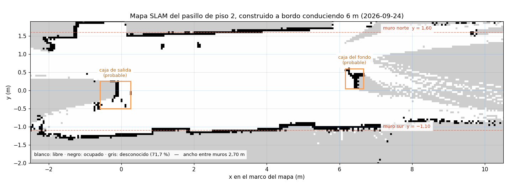

# Guion de campo — piso 2, recorrido propio y mapa

**Fecha de redacción:** 2026-09-24, noche
**Para quién:** ejecutable por cualquiera de los dos. Escrito pensando en que lo
corra **Jonny** sin haber estado en la sesión donde se armó.
**Vehículo:** `amss-ez9n` = **`192.168.0.102`**. Lee el §0.3 antes de usar el otro.

**Qué contesta.** Dos preguntas, en este orden de prioridad:

1. **¿Cuánto se equivoca rf2o midiendo un recorrido real?** Es G-2, la compuerta
   del corte C-1 del viernes 2 de octubre.
2. **¿El mapa que construye el vehículo en el pasillo de piso 2 se parece al
   pasillo?** Es lo que decide si se puede navegar sobre un mapa propio.

> **Sustituido para G-2 el 2026-09-25.** Las corridas de 6 m de este guion ya no hacen falta: el mapa
> del pasillo existe y admite 5 m, y G-2 se mide con las tres corridas de la sesión de compuertas de
> [`GUIA_CAMPANA_NAV2_HARDWARE.md`](GUIA_CAMPANA_NAV2_HARDWARE.md). Este guion queda para **volver a
> mapear** si el sitio cambia. El plan de la semana está en [`PLAN_S25.md`](PLAN_S25.md).

**Para navegar sobre el mapa que sale de aquí**, el procedimiento es otro:
[`GUIA_CAMPANA_NAV2_HARDWARE.md`](GUIA_CAMPANA_NAV2_HARDWARE.md).

**Qué NO es.** No es una prueba de Nav2.

> *Corregido el 2026-09-25.* Aquí decía que Nav2 no podía navegar por «cuatro defectos de
> configuración sin corregir». Era falso: esos defectos son de `nav2_slam_params.yaml`, que el
> vehículo no usa, y esa misma noche Jonny navegó el carro con Nav2. Detalle en el §6 de
> [`S24_mapeo_6m_hardware.md`](Evidencia/S24_mapeo_6m_hardware.md).

---

## 0. Antes de salir, desde el escritorio

### 0.1 · Copiar las herramientas al vehículo

Los cuatro ficheros van **al mismo directorio**, y ese directorio **no puede ser
`/tmp`**: el vehículo reinició solo en mitad de la sesión del 24-sep y se llevó
todo lo que había allí.

| | |
|---|---|
| **Objetivo** | Que el vehículo tenga las herramientas en un sitio que sobreviva a un reinicio. |
| **Comando** | `scp herramientas/mapear_conduciendo.sh herramientas/avanzar_y_detener.py herramientas/lanzar_bag.inc Robot/aws-deepracer/deepracer_bringup/config/slam_toolbox_carro.yaml deepracer@192.168.0.102:~/tesis/` |
| **Esperado** | Cuatro líneas de progreso, sin errores. Si dice `No such file or directory`, el directorio no existe: créalo con `ssh deepracer@192.168.0.102 "mkdir -p ~/tesis"` y repite. |
| **Si falla** | Comprueba red con `ping -c2 192.168.0.102`. Si responde el ping y no el `scp`, el vehículo está arrancando todavía: espera un minuto. |
| **Cierre** | `ssh deepracer@192.168.0.102 "ls ~/tesis"` lista los cuatro nombres. |

### 0.2 · Comprobar que el vehículo tiene lo que hace falta

| | |
|---|---|
| **Objetivo** | Que estén rf2o compilado, `slam_toolbox` y el nodo de `/cmd_vel`. |
| **Comando** | `ssh deepracer@192.168.0.102 "source /opt/ros/jazzy/setup.bash; source ~/nav_ws/install/setup.bash; source ~/coordinacion_ws/install/setup.bash; ros2 pkg list 2>/dev/null \| grep -E 'rf2o_laser_odometry\|slam_toolbox\|cmdvel_to_servo_pkg'"` |
| **Esperado** | Las tres líneas. |
| **Si falla** | Falta `rf2o_laser_odometry`: se compila con `ssh deepracer@192.168.0.102 "source /opt/ros/jazzy/setup.bash && cd ~/nav_ws && colcon build --symlink-install --packages-select rf2o_laser_odometry"`, tarda **3 minutos**. Faltan `slam_toolbox` o Nav2: `ssh deepracer@192.168.0.102 "sudo -n apt-get update && sudo -n DEBIAN_FRONTEND=noninteractive apt-get install -y ros-jazzy-navigation2 ros-jazzy-nav2-bringup"`, son 261 paquetes y **hace falta internet en el vehículo**. |
| **Cierre** | Las tres presentes. |

### 0.3 · El otro vehículo

Los dos vehículos tienen Nav2, `slam_toolbox` y rf2o desde la nivelación del 24-sep
([`GUION_NAV2_HARDWARE.md`](GUION_NAV2_HARDWARE.md) §0). **Lo que cambia de uno a otro son
los ficheros de `~/tesis/`**: copia los del §0.1 a los dos, que es lo que pide la regla de
`CLAUDE.md`, y comprueba con el §0.2 el que vayas a usar.

> *Corregido el 2026-09-25.* Aquí decía que `amss-jgm9` no tenía esos paquetes. Era falso
> cuando se escribió; ver el §6 de [`S24_mapeo_6m_hardware.md`](Evidencia/S24_mapeo_6m_hardware.md).

### 0.4 · Qué llevar

Flexómetro (el de 5 m no basta: hace falta medir 6 m de una vez o marcar a
mitad), cinta de enmascarar para las marcas, y algo para anotar. El nivel de
batería se lee por software, no hace falta instrumento.

---

## 1. El sitio: qué buscar en el piso 2

Un tramo **recto y despejado de al menos 8 m**, para poder correr 6 m con margen
por delante. El vehículo frena solo si ve algo a menos de 0,45 m, pero esa
protección **solo cubre un cono de 40° al frente**: los lados no.

Marca con cinta **dos rayas transversales separadas exactamente 6,00 m**, y mide
esa separación con el flexómetro **antes** de correr nada. Esa cifra es la verdad
de terreno de todo el guion; si se mide después o «a ojo», la corrida no vale
para G-2.

> **Por qué 6 m y no 20.** G-2 pide ≥ 5 m. Seis los cumple con margen, caben en
> casi cualquier tramo del edificio, y a la velocidad real medida —entre 0,14 y
> 0,26 m/s— son entre 25 y 45 s de marcha. Veinte metros serían tres minutos de
> batería por corrida y no añaden nada al criterio.

El vehículo se alinea con su **eje delantero** sobre la primera raya, apuntando a
la segunda, lo más recto que se pueda a ojo. No hay lazo de rumbo: si sale
torcido, se escora.

---

## 2. Comprobación previa, con el vehículo ya en el sitio

| | |
|---|---|
| **Objetivo** | Saber que el láser publica y con cuánta batería se arranca, antes de gastar corridas. |
| **Comando** | `ssh deepracer@192.168.0.102 "sudo -n bash -c 'source /opt/ros/jazzy/setup.bash && source /opt/aws/deepracer/lib/setup.bash && timeout 15 ros2 topic echo /rplidar_ros/scan --field header.frame_id --qos-reliability best_effort --once && ros2 service call /i2c_pkg/battery_level deepracer_interfaces_pkg/srv/BatteryLevelSrv \"{}\"'"` |
| **Esperado** | `laser` y después `level=N`. En la sesión del 24-sep el nivel fue **6** antes y después de cada corrida. |
| **Si falla** | Si el `frame_id` no sale, `deepracer-core` no está publicando: `ssh deepracer@192.168.0.102 "sudo -n systemctl restart deepracer-core"` y espera 30 s. Si sale `level=-1`, **no hay alimentación de tracción**: conecta la batería del motor, que es distinta de la de cómputo. |
| **Cierre** | Los dos valores anotados en papel. |

---

## 3. Bloque 1 — la corrida de G-2. **Esto es lo prioritario**

Si el día se tuerce y solo da tiempo a una cosa, es esta.

### 3.1 · Correr

| | |
|---|---|
| **Objetivo** | Un recorrido de 6 m medido a la vez por rf2o y por flexómetro. |
| **Comando** | `ssh deepracer@192.168.0.102 "sudo -n bash ~/tesis/mapear_conduciendo.sh 6.0 0.5 90"` |
| **Esperado** | Ver §3.2. |
| **Si falla** | Ver §3.3. |
| **Cierre** | `motivo de parada : DISTANCIA ALCANZADA` y el mapa escrito. |

**La secuencia, para que nadie se asuste ni toque el vehículo cuando no debe:**

1. Limpieza y arranque de nodos: unos **25 s**. El vehículo quieto.
2. `== activando slam_toolbox ==` → debe decir `estado: active [3]`.
3. `== asentando rf2o (4 s) ==` → quieto.
4. `== reposo: midiendo la deriva (6 s) ==` → **NO TOQUES EL VEHÍCULO**. Aquí se
   mide el suelo de ruido; una mano encima lo invalida.
5. **Arranca y avanza.** Entre 25 y 45 s.
6. Para sola, espera 8 s, cierra el bag y extrae el mapa.

**En cuanto pare, y antes de moverlo:** mide con el flexómetro desde la primera
raya hasta el eje delantero del vehículo. **Esa es la cifra de G-2.**

### 3.2 · Qué tiene que salir

```
   estado: active [3]
   deriva en reposo: 0.001 m en 6 s
motivo de parada : DISTANCIA ALCANZADA
recorrido rf2o   : 6.032 m  (pedido 6.00 m)
tiempo de marcha : 40.51 s   en 2085 ordenes de traccion
velocidad media  : 0.149 m/s  (mandada 0.50 m/s)
  message_count: 1390
mensajes en /map: 163   ultimo: 447 x 108 celdas, 0.050 m/celda
escrito .../mapa.pgm  (1017 ocupadas, 12638 libres, 34621 desconocidas)
```

Las tres líneas que hay que mirar sí o sí:

| Línea | Qué significa si sale mal |
|---|---|
| `estado: active [3]` | Si dice otra cosa, **el guion aborta solo** y el vehículo no se mueve. No hay mapa posible. |
| `deriva en reposo` | Por encima de **0,05 m** algo va mal: alguien tocó el vehículo, o el suelo vibra. Repite. |
| `en N ordenes de traccion` | Un **0** ahí significa que el vehículo **no recibió ninguna orden** y lo que aparece como recorrido es deriva. Pasa si hay una pared a menos de 0,45 m delante. |

### 3.3 · Los fallos conocidos, por orden de probabilidad

| Síntoma | Causa medida | Qué hacer |
|---|---|---|
| `ABORTA: slam_toolbox no quedo activo` | las transiciones de ciclo de vida no cerraron | repite la orden; si insiste, `ssh deepracer@192.168.0.102 "sudo -n pkill -9 -f sync_slam_toolbox_node"` y repite |
| `ABORTA: /rplidar_ros/scan no publica` | `deepracer-core` caído o tocado | `sudo -n systemctl restart deepracer-core`, espera 30 s |
| `NO ARRANCA: hay algo a X m delante` | pared u obstáculo dentro de los 0,45 m | mueve el vehículo hacia atrás o aparta el obstáculo |
| `ERROR: nadie escucha /cmd_vel` | `cmdvel_to_servo_node` no arrancó | el guion lo lanza solo; si falla, mira `ssh deepracer@192.168.0.102 "sudo -n tail -20 /tmp/cmdvel.log"` |
| `AVISO: el bag no cerro` | no debería pasar ya | la corrida **sigue siendo válida para G-2** —la cifra sale por pantalla— pero se pierde el crudo |
| El vehículo no se mueve y no hay error | velocidad pedida por debajo de 0,40 m/s | **nunca bajes del 0,5** del comando. Por debajo de 0,40 la cadena traduce a tracción cero sin avisar |

### 3.4 · Repetir, que es lo que da la cifra

**Tres corridas como mínimo**, volviendo a alinear en la primera raya cada vez.
G-2 se decide con el error relativo, y una sola corrida no distingue un sesgo de
un golpe de suerte.

Entre corrida y corrida, vuelve a leer la batería con el comando del §2 y anótala:
en la sesión del 24-sep **la misma orden dio 0,261 m/s y 0,149 m/s en dos corridas
seguidas**, un factor de 1,75 sin explicación, y la batería es el primer
sospechoso.

---

## 4. Bloque 2 — el mapa

No hay nada que correr aparte: **cada corrida del §3 ya construye su mapa**. Este
bloque es lo que hay que mirar y anotar.

| | |
|---|---|
| **Objetivo** | Saber si el mapa se parece al pasillo. |
| **Comando** | `scp -r deepracer@192.168.0.102:'~/mapeo_*' ~/tesis_evidencia/` y después `eog ~/tesis_evidencia/mapeo_*/mapa.pgm` |
| **Esperado** | Dos paredes casi paralelas, espacio libre entre ellas, y abanicos abiertos en los extremos donde el láser se escapa. |
| **Si falla** | Si sale un borrón o paredes dobles, rf2o perdió el rumbo: anótalo y **guarda el bag igual**, que es lo que permite rehacerlo. |
| **Cierre** | El ancho entre paredes del mapa, contrastado con el flexómetro. |

**Mide el ancho real del pasillo con el flexómetro** y compáralo con el del mapa.
Es el único contraste de geometría que tendrá este mapa: el del cuarto de 1,60 m
dio 1,55 × 0,80 m contra 1,60 × 0,76 m de cinta, una celda de error, y eso es lo
que valida la cadena.

Para sacar el ancho del mapa en el escritorio:

```bash
python3 -c "from PIL import Image; import numpy as np; a=np.array(Image.open('mapa.pgm')); p=np.argwhere(a<50); print('ocupado: %.2f x %.2f m' % ((np.ptp(p[:,1])+1)*0.05, (np.ptp(p[:,0])+1)*0.05))"
```

Así salió la corrida del 24-sep, dibujada en metros:



> **Ojo con la extensión del mapa.** La corrida del 24-sep recorrió 6 m y el mapa
> salió de 21,75 m de largo. No es un error: es lo que el LiDAR alcanzó a ver
> desde los 6 m recorridos. **Lo que hay que medir es el ancho entre paredes**, no
> el largo.

---

## 5. Qué anotar en papel, por corrida

Sin esto la salida no sirve, porque las cifras de pantalla se pierden.

| Campo | De dónde sale |
|---|---|
| Nº de corrida y hora | reloj |
| Batería antes / después | comando del §2 |
| Separación real de las rayas | flexómetro, **medida antes de correr** |
| Deriva en reposo | pantalla |
| Recorrido según rf2o | pantalla |
| **Distancia real recorrida** | **flexómetro, al parar y antes de mover el vehículo** |
| Tiempo de marcha y nº de órdenes | pantalla |
| Nombre de la carpeta `mapeo_HHMMSS` | pantalla |
| Ancho real del pasillo | flexómetro, una sola vez |
| Incidencias | lo que pase |

---

## 6. Recogida, antes de apagar nada

| | |
|---|---|
| **Objetivo** | Que los crudos salgan del vehículo. La tarjeta se ha vaciado sola antes. |
| **Comando** | `scp -r deepracer@192.168.0.102:'~/mapeo_*' ~/tesis_evidencia/` |
| **Esperado** | Una carpeta por corrida, cada una con `bag/`, `mapa.pgm`, `mapa.yaml` y los cuatro logs. |
| **Si falla** | Repite apuntando a una carpeta concreta. |
| **Cierre** | `ls ~/tesis_evidencia/mapeo_*/bag/metadata.yaml` lista un fichero por corrida. **Si falta alguno, ese bag está ilegible** y hay que decirlo. |

Comprueba además que los bags traen datos y no están vacíos:

```bash
grep -h 'message_count' ~/tesis_evidencia/mapeo_*/bag/metadata.yaml | head
```

Un `message_count: 0` significa que se grabó con el usuario equivocado. No
debería pasar —el guion corre como `root`— pero es barato mirarlo.

---

## 7. Criterio de cierre del guion

| | Se cierra cuando | Estado |
|---|---|---|
| **G-2** | hay ≥ 3 corridas con recorrido de rf2o **y** medida de flexómetro, y el error relativo está calculado | falta la medida de cinta |
| **Mapa** | el ancho entre paredes del mapa coincide con el flexómetro dentro de 2 celdas (0,10 m) | falta |
| **Escala de tracción (RF-14)** | se conoce la velocidad real a `throttle 0,4247` con varianza explicada | hay 3 medidas, **no repetibles** |

Al volver, el análisis se hace en el escritorio con
[`medir_g2.py`](../herramientas/medir_g2.py) sobre los bags, siguiendo
[`GUIA_PASADA_LOCALIZACION.md`](GUIA_PASADA_LOCALIZACION.md). Los bags vienen de
Jazzy, así que hay que adaptarlos antes:

```bash
python3 herramientas/adaptar_bag_jazzy.py ~/tesis_evidencia/mapeo_HHMMSS/bag -o /tmp/g2_HHMMSS
```

**Y la regla que no se negocia:** si el error de G-2 sale peor que el 10 %, se
anota tal cual y se decide con los directores. No se ajusta el criterio para que
salga bien; ese reproche este proyecto ya se lo hizo el 26 de agosto.
